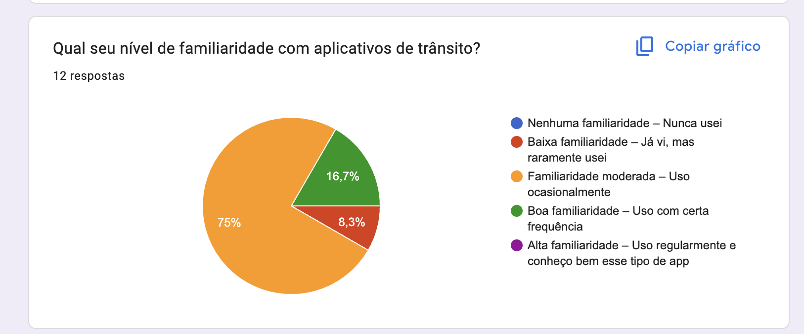
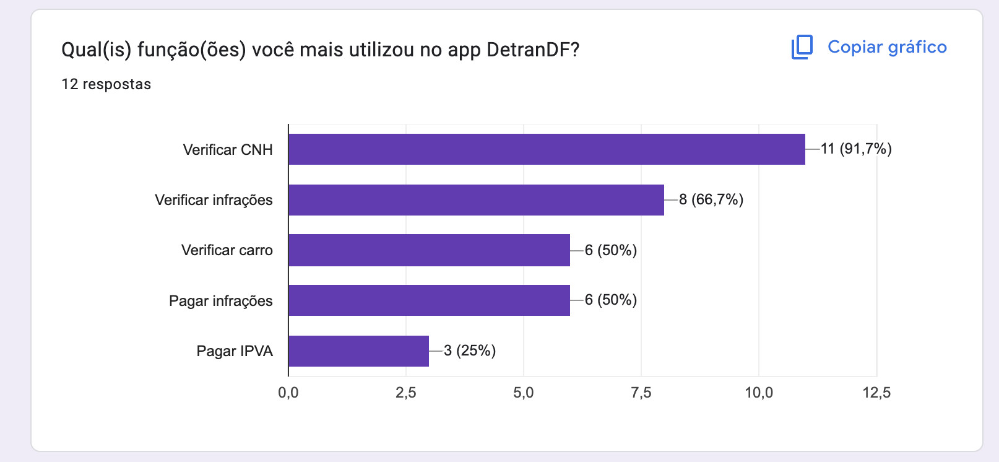
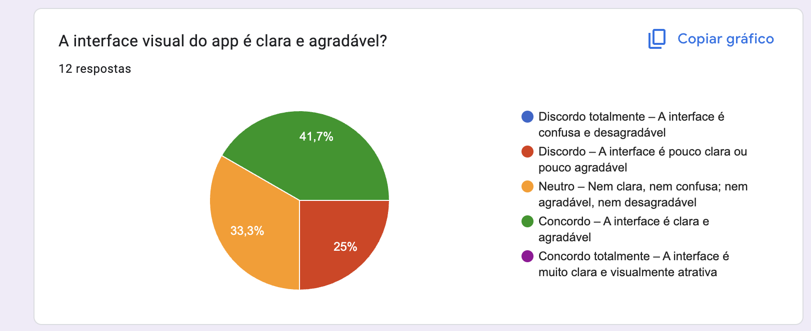
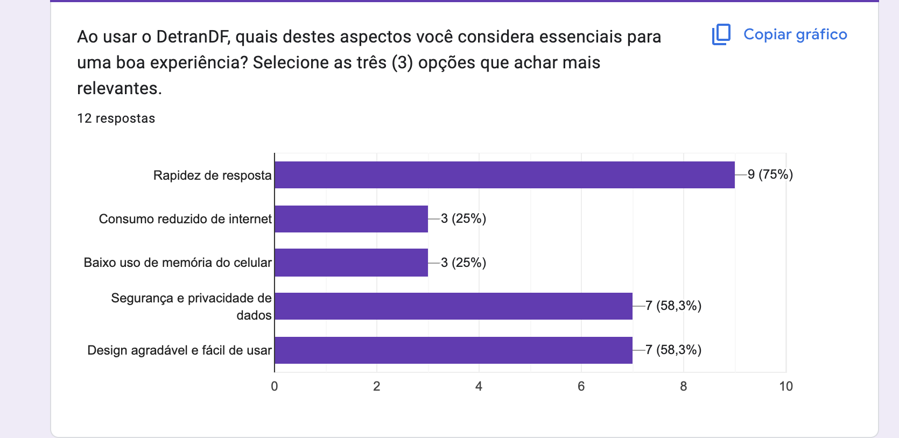

# Perfil do Usuário 

## Introdução

Parte importante do desenvolvimento do projeto é definir um perfil do usuário, sendo assim possível entender mais sobre os usuários que utilizam o sistema, deve-se ressaltar diversas características tais como: interesse, experiência, faixa etária, conhecimento prévio etc.

## Metodologia

Foi elaborado um questionário no Google Forms de 22 questões a respeito dos usuaŕios, incluindo questões demográficas e relacionadas com o uso aplicativo, além disso foi elaborado o Termo de Consentimento Livre e Esclarecido, de acordo com a Resolução Nº 466 de 12 de Dezembro de 2012.

 
<iframe src="https://docs.google.com/forms/d/e/1FAIpQLScrRO7eckymM5v7Z1ykowHE3p_oPb8s3iTxVwlniwsmvxhHSQ/viewform?usp=header" width="640" height="350" frameborder="0" marginheight="0" marginwidth="0">Carregando…</iframe>

## Resultados do questionário

 
Em relação às perguntas temos que na primeira pergunta ***Você já utilizou o aplicativo DetranDF?***, temos os resultados na representação gráfica presente na <i>Figura 1</i>. Podemos notar que, cerca de 60 por cento da amostra utiliza o DetranDF.

<figcaption align='center'>
 <h6> <b>Figura 1 – Gráfico com o percentual de respostas da questão 1</b> 
  Fonte: Retirada da página de resultados do Google Forms</h6>
</figcaption>

Na segunda pergunta ***Você se encaixa e, algum desses perfis?*** Mais da metade, cerca de sessenta e seis por cento se encaixa no usuário com comum com CNH, como mostra a <i>Figura 2</i>.

<figcaption align='center'>
 <h6> <b>Figura 2 – Gráfico com o percentual de respostas da questão 2</b> 
  Fonte: Retirada da página de resultados do Google Forms</h6>
</figcaption>

Agora na <i>Figura 3</i> temos ***Qual sua faixa etária?*** Que mostra que mais de 66 por cento da amostra é está entre 18-25 anos de idade.

<figcaption align='center'>
 <h6> <b>Figura 3 – Gráfico com o percentual de respostas da questão 3</b> 
  Fonte: Retirada da página de resultados do Google Forms</h6>
</figcaption>

Agora na <i>Figura 4</i> temos ***Com que gênero você se identifica?*** Que mostra que 50% são homens e 50% são mulheres.

<figcaption align='center'>
 <h6> <b>Figura 4 – Gráfico com o percentual de respostas da questão 4</b> 
  Fonte: Retirada da página de resultados do Google Forms</h6>
</figcaption>

A quinta pergunta : ***Qual seu nível de familiaridade com aplicativos de trânsito?*** 75% da amostra indicou que tem familiaridade moderada<i>(Figura 5)</i>

<figcaption align='center'>
 <h6> <b>Figura 5 – Gráfico com o percentual de respostas da questão 5</b> 
  Fonte: Retirada da página de resultados do Google Forms</h6>
</figcaption>

A sexta pergunta : ***Com que freqência você costuma utilizar o DetranDF?*** 66% da amostra indicou que usa raramente<i>(Figura 6)</i>

<figcaption align='center'>
 <h6> <b>Figura 6 – Gráfico com o percentual de respostas da questão 6</b> 
  Fonte: Retirada da página de resultados do Google Forms</h6>
</figcaption>

A sétima pergunta : ***Como você conheceu o aplicativo DetranDF?*** 58% da amostra conheceu na auto-escola e também em sites oficiais<i>(Figura 7)</i>

<figcaption align='center'>
 <h6> <b>Figura 7 – Gráfico com o percentual de respostas da questão 7</b> 
  Fonte: Retirada da página de resultados do Google Forms</h6>
</figcaption>

A oitava pergunta : ***Qual(is) função(ões) você mais utilizou no app DetranDF?*** 91% da amostra usa para verificar a CNH<i>(Figura 8)</i>

<figcaption align='center'>
 <h6> <b>Figura 8 – Gráfico com o percentual de respostas da questão 8</b> 
  Fonte: Retirada da página de resultados do Google Forms</h6>
</figcaption>

A nona pergunta : ***O que mais te motivou a baixar ou utilizar o aplicativo?*** As respostas estão na imagem seguinte:<i>(Figura 9)</i>

<figcaption align='center'>
 <h6> <b>Figura 9 – Gráfico com o percentual de respostas da questão 9</b> 
  Fonte: Retirada da página de resultados do Google Forms</h6>
</figcaption>

A décima pergunta : ***Quais novas funcionalidades você gostaria de ver no app?*** As respostas estão na imagem seguinte:<i>(Figura 10)</i>

<figcaption align='center'>
 <h6> <b>Figura 10 – Gráfico com o percentual de respostas da questão 10</b> 
  Fonte: Retirada da página de resultados do Google Forms</h6>
</figcaption>

A pergunta 11: ***Como você avalia a facilidade do uso do app?*** 50% da amostra indicou que é fácil de usar<i>(Figura 11)</i>

<figcaption align='center'>
 <h6> <b>Figura 11 – Gráfico com o percentual de respostas da questão 11</b> 
  Fonte: Retirada da página de resultados do Google Forms</h6>
</figcaption>

A pergunta 12: ***A interface visual do app é clara e agradável?*** 41% da amostra concordou com a afirmação<i>(Figura 12)</i>

<figcaption align='center'>
 <h6> <b>Figura 12 – Gráfico com o percentual de respostas da questão 12</b> 
  Fonte: Retirada da página de resultados do Google Forms</h6>
</figcaption>

A pergunta 13: ***Você sente dificuldade para encontrar o que precisa no aplicativo, como opções, ferramentas ou informações?*** 33% da amostra indicaram neutro e discordo<i>(Figura 13)</i>

<figcaption align='center'>
 <h6> <b>Figura 13 – Gráfico com o percentual de respostas da questão 13</b> 
  Fonte: Retirada da página de resultados do Google Forms</h6>
</figcaption>

A pergunta 14: ***Caso tenha dificuldades no uso do aplicativo e queira detalhar melhor suas dificuldades, informe aqui.*** A resposta está na imagem seguinte:<i>(Figura 14)</i>

<figcaption align='center'>
 <h6> <b>Figura 14 – Gráfico com o percentual de respostas da questão 14</b> 
  Fonte: Retirada da página de resultados do Google Forms</h6>
</figcaption>

A pergunta 15: ***Ao usar o DetranDF, quais destes aspectos você considera essenciais para uma boa experiência? Selecione as três (3) opções que achar mais relevantes.*** 75% indicou rapidez da resposta<i>(Figura 15)</i>

<figcaption align='center'>
 <h6> <b>Figura 15 – Gráfico com o percentual de respostas da questão 15</b> 
  Fonte: Retirada da página de resultados do Google Forms</h6>
</figcaption>

A pergunta 16: ***Você sente que seus dados estão protegidos ao usar o app?*** 66% concordou com a afirmação<i>(Figura 16)</i>

<figcaption align='center'>
 <h6> <b>Figura 16 – Gráfico com o percentual de respostas da questão 16</b> 
  Fonte: Retirada da página de resultados do Google Forms</h6>
</figcaption>

A pergunta 17: ***Por favor, explique o que mais contribui para a sua percepção de segurança (ou insegurança) no app*** As respostas estão na imagem seguinte:<i>(Figura 17)</i>

<figcaption align='center'>
 <h6> <b>Figura 17 – Gráfico com o percentual de respostas da questão 17</b> 
  Fonte: Retirada da página de resultados do Google Forms</h6>
</figcaption>

A pergunta 18: ***Com que frequência você enfrenta falhas técnicas ao usar o aplicativo?*** 50% indicou raramente<i>(Figura 18)</i>

<figcaption align='center'>
 <h6> <b>Figura 18 – Gráfico com o percentual de respostas da questão 18</b> 
  Fonte: Retirada da página de resultados do Google Forms</h6>
</figcaption>

A pergunta 19: ***Se você indicou que já enfrentou falhas técnicas (por exemplo, escolher 'Às vezes', 'Frequentemente' ou 'Sempre'), por favor, conte-nos mais: descreva o que aconteceu e como essa situação afetou o uso do aplicativo.*** As respostas estão na imagem seguinte:<i>(Figura 19)</i>

<figcaption align='center'>
 <h6> <b>Figura 19 – Gráfico com o percentual de respostas da questão 19</b> 
  Fonte: Retirada da página de resultados do Google Forms</h6>
</figcaption>

A pergunta 20: ***Você considera o aplicativo útil para gerenciar CNH, carro e pagamento de infrações?*** 58% indicou que concorda<i>(Figura 20)</i>

<figcaption align='center'>
 <h6> <b>Figura 20 – Gráfico com o percentual de respostas da questão 20</b> 
  Fonte: Retirada da página de resultados do Google Forms</h6>
</figcaption>

A pergunta 21: ***O que te faria usar o aplicativo com mais frequência?*** As respostas estão na imagem seguinte:<i>(Figura 21)</i>

<figcaption align='center'>
 <h6> <b>Figura 21 – Gráfico com o percentual de respostas da questão 21</b> 
  Fonte: Retirada da página de resultados do Google Forms</h6>
</figcaption>

A pergunta 22: ***Avalie o aplicativo, considerando sua utilidade, funcionamento e aparência (quanto mais estrelas melhor):*** A avaliação geral foi 3.58 de 5<i>(Figura 22)</i>

<figcaption align='center'>
 <h6> <b>Figura 22 – Gráfico com o percentual de respostas da questão 22</b> 
  Fonte: Retirada da página de resultados do Google Forms</h6>
</figcaption>

## Definição do Perfil

Com base nos resultados obtidos, a conclusão é que o perfil do usuário possui as seguintes características:

Tabela 1: Características do perfil do usuário

| Característica                          | Detalhamento                                                                                           | Origem                       |
| --------------------------------------- | ------------------------------------------------------------------------------------------------------ | ---------------------------- |
| **Idade:**                               | Faixa etária: 18-50+                                                                                   | <a href="#fig-3">Figura 3</a> |
| **Gênero:**                              | Masculino / Feminino                                                                                   | <a href="#fig-4">Figura 4</a> |
| **Documentos necessários:**                        | CNH válida                                                                    | <a href="#fig-8">Figura 8</a> |
| **Nível de experiência com o app:** | 75% com familiariedade moderada         | <a href="#fig-5">Figura 5</a> |
| **Tarefas primárias:**                  | Verificar CNH, verificar infrações, verificar carro, pagar infrações        | <a href="#fig7">Figura 7</a> |
| **Tarefas secundárias:**                |  pagar IPVA                                                                                    | <a href="#fig-7">Figura 7</a> |

Fonte: [Gabriel Mendes](https://github.com/gbevi), 2025.

## Conclusão 

Como os resultados do questionário apontam, o perfil do usuário tem como perfil pessoas com idade entre 18 anos e 50 anos, com CNH. Além disso foi identificado que os usuários desse aplicativo não usam o app com muita frequência, apenas para fazer consultas ocasionais.

## Referências

> Resolução CNS nº 466/2012. <https://bvsms.saude.gov.br/bvs/saudelegis/cns/2013/res0466_12_12_2012.html> acesso feito em 23 de Abril de 2025.

> Questionário de Elicitação de Requisitos - Aplicativo Guardiões da Saúde (UnB). <https://docs.google.com/forms/d/e/1FAIpQLSd9TjbIRZfV55i_vCmdQV-5BMj1TRb05PlkTeWcLJ6PPrCJuw/viewform> acesso feito em 23 de Abril de 2025.

## Histórico de versão
| Versão | Data | Descrição | Autor | Revisor |
| :----: | :--: | :-------: | :---: | :-----: |
| 1.0 | 23/04/2025 | Inicialização da página | [Gabriel Dantas](https://github.com/gbevi) | [Giovana Barbosa ](https://github.com/gio221)  |
| 1.1 | 17/06/2025 | adição da definição de perfil | [Gabriel Dantas](https://github.com/gbevi) |   |