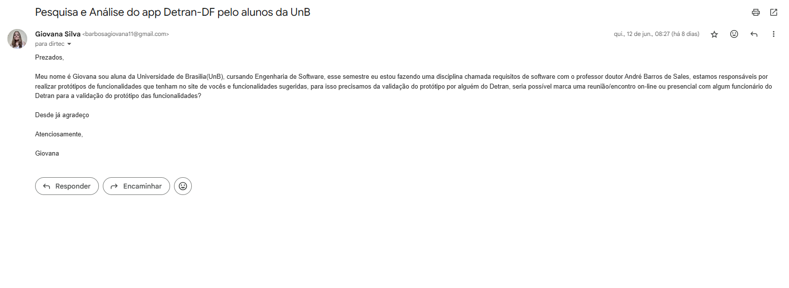

# Introdução
Tentamos contato via e-mail com o DETRAN-DF

# Objetivo

Queriamos que algum funcionário do detran-df validace nossos prototipos e nosso projeto 

# E-mail

Apesar de enviarmos o e-mail, não obtivemos retorno, o email está logo abaixo

<b> Figura 1:</b> email

Fonte: [Giovana Barbosa](https://github.com/gio221) , 2025.

## Histórico de versão

| Versão |    Data    |       Descrição        |                     Autor                      |                  Revisor                   |
| :----: | :--------: | :--------------------: | :--------------------------------------------: | :----------------------------------------: |
|  1.0   | 17/06/2025 | envio do email, e documentação |  [Giovana Barbosa](https://github.com/gio221)   | [Gabriel Dantas](https://github.com/gbevi) |
