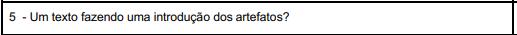
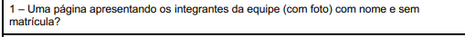
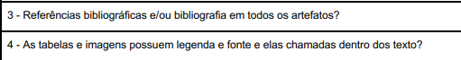

## Objetivo

Este artefato tem como objetivo analisar a interface da página inicial (home) do grupo responsável pelo aplicativo DetranDF. A verificação foca em identificar os principais elementos visuais e informativos presentes na home, avaliando sua organização, usabilidade e aderência aos propósitos do sistema.

## Metodologia

Conforme exemplificado na Tabela 1, cada item do checklist é composto por: uma identificação numérica, a descrição do elemento avaliado, a resposta correspondente à análise (que pode ser "Sim", "Não", "Incompleto" ou "Não se Aplica"), o número da referência bibliográfica e um link com um print que comprova a fonte utilizada para fundamentar o item. Ao final da verificação, os itens com avaliações negativas são detalhados na seção de Problemas Encontrados.

A tabela 1 descreve a checklist relativa a home do projeto.

    Tabela 1: Checklist home

| ID  | Critérios                                                            | Sim/Não/Incompleto | Print                                                                                       |
| :-: | -------------------------------------------------------------------- | ------------------ | ------------------------------------------------------------------------------------------- |
|  1  | A home do projeto apresenta introdução sobre a disciplina/artefatos? |               |  |
|  2  | A home dá uma breve introdução sobre o que é o aplicativo escolhido? |              |  |
|  3  | A home explica brevemente o motivo da escolha do aplicativo?         |               |  |
|  4  | Nome e foto de todos os membros do grupo constam?                    |            |  |
|  5  | A home segue o padrão para referências e formatação?                 |            |  |

Fonte: [Pedro Camilo ](https://github.com/PedrooCamilo), 2025.

### Conclusão

A home atende à checklist estipulada.

## Bibliografia

> Verificação https://requisitos-de-software.github.io/2025.1-DetranDF/

# Histórico de versão

| Versão |    Data    |       Descrição        |                      Autor                       |                    Revisor                    |
| :----: | :--------: | :--------------------: | :----------------------------------------------: | :-------------------------------------------: |
|  1.0   | 14/04/2025 | Início da documentação | [Pedro Camilo ](https://github.com/PedrooCamilo) | [Giovana Barbosa ](https://github.com/gio221) |
