# Introdução

Os **Requisitos Não-Funcionais (RNFs)** são essenciais para a qualidade de sistemas de software, influenciando usabilidade, desempenho e conformidade. No entanto, são frequentemente mal definidos, o que afeta negativamente a satisfação dos stakeholders e a qualidade do produto.

Devido à sua **subjetividade e complexidade**, a documentação e análise dos RNFs são desafiadoras.

Para lidar com essas dificuldades, foi proposto o **NFR Framework** (Chung et al., 2000), que modela RNFs como **softgoals** — objetivos sem critérios de satisfação claros — organizados em **Softgoal Interdependency Graphs (SIGs)**, que mostram as relações de apoio ou conflito entre os RNFs.

# SIG - Softgoal Interdependency Graph

Gráfico de interdependências entre softgoals é um gráfico que registra as considerações do desenvolvedor sobre os softgoals, como também armazenam um registro completo das decisões de desenvolvimento e da lógica do projeto de forma gráfica e concisa. Esse registro inclui Requisitos Não-funcionais e suas alternativas, decisões e justificativas associadas às decisões

# Tipos de Softgoals

- **Softgoals NFR**: Representam os requisitos não-funcionais (ex: segurança, usabilidade).
- **Softgoals de Operacionalização**: Soluções práticas para atender aos RNFs (ex: processos, estruturas de dados).
- **Softgoals de Afirmação**: Características do domínio que justificam decisões (ex: prioridades, carga de trabalho).

<b> Figura 1:</b> Tipos de Softgoals 
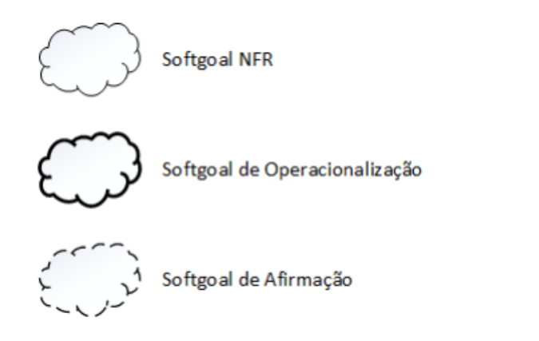
 
<b>Fonte:</b> (CHUNG et al., 2000)

# Interdependências

As interdependências definem as relações entre os softgoals. Os tipos de interdependências
utilizadas pelo framework são os refinamentos e as contribuições(CHUNG et al., 2000).

# Decomposições

As decomposições têm o objetivo de refinar softgoals para obter softgoals mais especializados e estes possam auxiliar na construção do projeto. Os quatro tipos de decomposições
utilizadas pelo NFR Framework são descritos abaixo: 

- **Decomposição de Softgoal NFR:** refina ou subdivide um softgoal NFR em outros específicos. Isso pode ajudar a dividir grandes problemas em problemas menores e oferece um aspecto útil para lidar com ambiguidades e prioridades.

- **Decomposição de Operacionalização:** subdivide um softgoal de operacionalização em outros softgoals de operacionalização mais específicos. Operacionalizações são úteis para definir uma solução geral e refiná-la em soluções mais específicas.

- **Decomposição de Afirmação (Claims):** refina um softgoal de afirmação em outros softgoals de afirmação. Ela é importante para apoiar ou negar justificativas específicas de projeto.

- **Priorização:** A priorização é um tipo especial de decomposição, onde ocorre o refinamento de um softgoal em outro softgoal com o mesmo tipo e tópicos, mas com uma prioridade associada.

**Figura 2:** Tipos de Decomposições

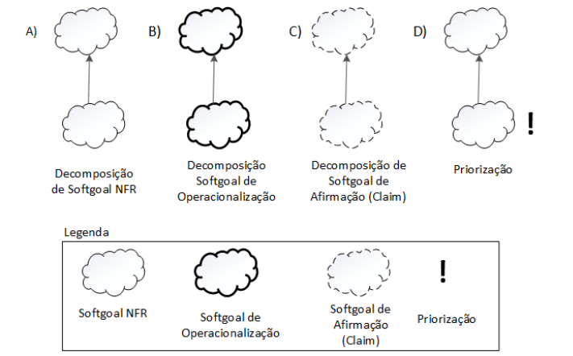

**Fonte:** (CHUNG et al., 2000)
, 2025.

# Contribuições

No NFR Framework pode-se utilizar de vários tipos de contribuições que explicam de que maneira a satisfação ou não de um softgoal descendente auxilia a satisfação do softgoal ascendente. Abaixo estão os tipo de contribuições:

- **AND:** Todos os softgoals descendentes precisam ser satisfeitos para satisfazer o ascendente.

- **OR:** Basta que um descendente seja satisfeito para satisfazer o ascendente.

- **MAKE (++):** Satisfação total do descendente garante satisfação total do ascendente.

- **BREAK (--):** Satisfação total do descendente gera negação total do ascendente.

- **HELP (+):** Satisfação parcial do descendente contribui positivamente para o ascendente.

- **HURT (-):** Satisfação do descendente prejudica parcialmente o ascendente.

- **UNKNOWN (?):** Contribuição incerta, pode ser positiva ou negativa.

- **EQUALS:** O descendente acompanha exatamente o estado do ascendente (satisfeito ou negado).

- **SOME (+/-):** Contribuição positiva ou negativa, mas sem certeza se é parcial ou total.

Abaixo nas figuras 03 e 04 encontra-se respectivamente exemplos das contribuições " AND ", " OR " e " MAKE ", "BREAK", " HELP " e " HURT ".

**Figura 3:** Tipos de Decomposições

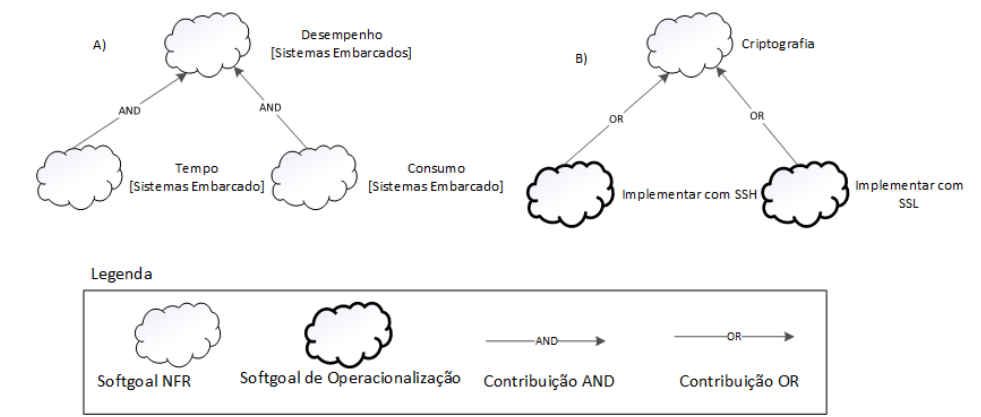

**Fonte:** (SILVA, Reinaldo Antônio. NFR4ES)
, 2025.

**Figura 4:** Tipos de Decomposições

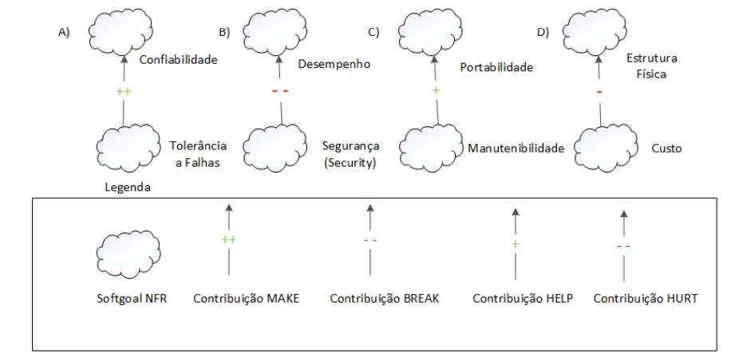

**Fonte:** (SILVA, Reinaldo Antônio. NFR4ES)
, 2025.

# Propagação de Impactos

A propagação de impactos denota a relação entre os requisitos não-funcionais e como a mudança em um requisito pode provocar mudanças em requisitos relacionados. São utilizados para representar esses impactos os softgoals de impacto. Abaixo estão representados a notação com a qual eles são utilizados:

- **✓** (satisfeito): indica que um requisito não funcional contribui de forma positiva para a satisfação de outro requisito.

- **𝒲+** (fracamente satisfeito): representa uma relação positiva, porém menos intensa do que a notação ✓.

- **X** (negado): indica que um requisito não funcional prejudica ou contradiz a realização de outro requisito.

- **𝒲-** (fracamente negado): similar à notação X, porém com uma influência negativa menos forte.

- **🗲** (conflitante): representa uma relação de conflito, em que os requisitos apresentam aspectos tanto positivos quanto negativos.

- **u** (indeterminado): indica uma relação desconhecida ou indefinida entre os requisitos, quando não há informações suficientes para avaliar o impacto.

# Cartões de Especificação

A utilização de cartões de especificação proporciona uma abordagem estruturada e clara para documentar cada requisito não funcional. Esses cartões reúnem informações fundamentais, como a descrição, a justificativa, a origem, os critérios de aceitação, as dependências, a prioridade, possíveis conflitos e o histórico de alterações. A Tabela 1 apresenta uma visão detalhada e de fácil compreensão dos RNFs, destacando os principais elementos que devem compor cada cartão de especificação.

<b>Tabela 1:</b>Modelo de Cartões de Especificação

|                  Item                   |                                                                      Descrição                                                                       |
| :-------------------------------------: | :--------------------------------------------------------------------------------------------------------------------------------------------------: |
| **Nr Requisito** (Um número sequencial) |                                       **Classificação**: Classificação do RNF conforme hierarquia do catálogo                                        |
|              **Descrição**              |                                                     Declaração única do significado do requisito                                                     |
|            **Justificativa**            |                                                      Justificativa sobre a criação do requisito                                                      |
|               **Origem**                |                                                Origem do requisito (stakeholder, norma técnica, etc)                                                 |
|        **Critério de Aceitação**        |                                         Métrica do requisito que possa ser testada e que deve ser satisfeita                                         |
|            **Dependências**             |                                                            Requisitos relacionados a este                                                            |
|             **Prioridade**              | Um número usado para decidir a importância relativa deste requisito entre os outros RNFs (varia de 1 a 10). A prioridade mínima é 1 e a máxima é 10 |
|              **Conflitos**              |                                                           Requisitos conflitantes com este                                                           |
|              **História**               |                                                          Data de criação e de modificações                                                           |

Fonte: [Giovana Barbosa](https://github.com/gio221) , 2025.

# Objetivo

O objetivo deste trabalho é desenvolver um artefato, fundamentado no **NFR Framework**, que possibilite a identificação, representação e análise dos requisitos não funcionais relacionados ao aplicativo do **Detran-DF.**

# Metodologia  
Para uma abordagem completa, dividimos a metodologia em algumas fases, sendo elas:

- **Fase 1: Elicitação de Requisitos Não-Funcionais**:  
Primeiro fizemos a elicitação de requisitos na etapa anterior, que pode ser encontrada nesse link [Requisitos Elicitados](../../Elicitação/Tecnicas-de-elecitação/requisitos-elicitados.md).

- **Fase 2: Criação de Grafos de Decomposição de Softgoals e Criação de Cartões de Especificação**:

    Inspirando-se em técnicas de especificação (como as descritas no livro Requirements Engineering Fundamentals) faremos o cartão de especificação para cada decomposição:

    -	Para cada softgoal, criar cartões que detalhem:

    -	Descrição do RNF.

    -	Alternativas de implementação.

    -	Dependências e restrições.

    -	Os cartões ajudam a capturar os trade-offs entre alternativas e priorizações.

- **Fase 3: SIG**:

    Após a criação dos grafos de decomposição, o SIG é consolidado:

    -	SIG: Integrar todos os softgoals, suas contribuições e refinamentos no grafo final, criando uma visão abrangente dos RNFs para o aplicativo Detran-DF.

- **Fase 4: Avaliação e Validação**:

    Por fim, validar o artefato construído, considerando os seguintes passos:

    -	Seleção entre alternativas: Comparar diferentes abordagens utilizando critérios de qualidade, custos e impacto para selecionar a melhor solução.

    -	Revisão com stakeholders: Submeter o SIG final para análise dos stakeholders e ajustar conforme o feedback recebido.

- **Fase 5: Propragação de impactos**:
   No NFR Framework, a propagação de impactos consiste em identificar as relações de dependência entre os requisitos não funcionais e analisar como alterações em um requisito podem influenciar outros requisitos relacionados, utilizando, como mostrado anteriormente, as notações dos softgoals de impacto para representar graficamente essas relações.

## 1. NFR Usabilidade

<b>Tabela 1:</b>Requisitos não funcionais de usabilidade 

| Código | Requisito |
|--------|-----------|
| RNF01 | Interface intuitiva e fácil de navegar |
| RNF04 | Área educacional com explicações e vídeos |
| RNF09 | Layout com foco em simplicidade e legibilidade |
| RNF12 | Explicações acessíveis sobre siglas (ex: RENAVAM) |
| RNF14 | Interface adaptada para idosos e iniciantes |
| RNF17 | Feedback visual e sonoro nas interações do usuário |
| RNF20 | Interface com poucos elementos por tela para facilitar leitura |

#### Cartões de Especificação:
Abaixo seguem as tabelas contendo os cartões de especificação dos requisitos não funcionais utilizados para a criação do NFR.

<b>Tabela 2:</b> Interface intuitiva e fácil de navegar 

| **Item**                  | **Descrição**                                                       |
| ------------------------- | ------------------------------------------------------------------- |
| **Nr Requisito**          | [RNF01](../../Elicitação/Tecnicas-de-elecitação/requisitos-elicitados.md#tabela-requisitos)                                                               |
| **Classificação**         | Usabilidade > Interface                                             |
| **Descrição**             | Interface intuitiva e fácil de navegar                              |
| **Justificativa**         | Facilitar o uso do sistema por qualquer perfil de usuário           |
| **Origem**                | [BS13](../../Elicitação/Tecnicas-de-elecitação/brainstorming.md#tabela-requisitos), [IS07](../../Elicitação/Tecnicas-de-elecitação/Introspecção.md#tabela-requisitos)                                   |
| **Critério de Aceitação** | Usuários realizam tarefas principais sem necessidade de treinamento |
| **Dependências**          | [RNF09](../../Elicitação/Tecnicas-de-elecitação/requisitos-elicitados.md#tabela-requisitos), [RF20](../../Elicitação/Tecnicas-de-elecitação/requisitos-elicitados.md#tabela-requisitos)                                                        |
| **Prioridade**            | 10                                                                  |
| **Conflitos**             | Nenhum                                                              |
| **História**              | 01/06/2025 – Criação                                                |

Fonte: [Pedro Camilo](https://github.com/PedrooCamilo) , 2025.

---

<b>Tabela 3:</b> Área educacional com explicações e vídeos 

| **Item**                  | **Descrição**                                                                     |
| ------------------------- | --------------------------------------------------------------------------------- |
| **Nr Requisito**          | [RNF04](../../Elicitação/Tecnicas-de-elecitação/requisitos-elicitados.md#tabela-requisitos)                                                                             |
| **Classificação**         | Usabilidade > Conteúdo                                                            |
| **Descrição**             | Área educacional com explicações e vídeos                                         |
| **Justificativa**         | Promover autonomia e aprendizado do usuário sobre o sistema e o domínio           |
| **Origem**                | [BS16](../../Elicitação/Tecnicas-de-elecitação/brainstorming.md#tabela-requisitos)                                            |
| **Critério de Aceitação** | Disponibilidade de área educacional com pelo menos 5 vídeos e textos explicativos |
| **Dependências**          | [RNF12](../../Elicitação/Tecnicas-de-elecitação/requisitos-elicitados.md#tabela-requisitos)                                                                             |
| **Prioridade**            | 7                                                                                 |
| **Conflitos**             | Nenhum                                                                            |
| **História**              | 01/06/2025 – Criação                                                              |

Fonte: [Pedro Camilo](https://github.com/PedrooCamilo) , 2025.

---

<b>Tabela 4:</b> Layout com foco em simplicidade e legibilidade 

| **Item**                  | **Descrição**                                                                            |
| ------------------------- | ---------------------------------------------------------------------------------------- |
| **Nr Requisito**          | [RNF09](../../Elicitação/Tecnicas-de-elecitação/requisitos-elicitados.md#tabela-requisitos)                                                                                    |
| **Classificação**         | Usabilidade > Layout                                                                     |
| **Descrição**             | Layout com foco em simplicidade e legibilidade                                           |
| **Justificativa**         | Reduzir sobrecarga cognitiva e melhorar experiência do usuário                           |
| **Origem**                | [BS21](../../Elicitação/Tecnicas-de-elecitação/brainstorming.md#tabela-requisitos)                                                                  |
| **Critério de Aceitação** | Contraste adequado, fontes legíveis e ausência de excesso de elementos em todas as telas |
| **Dependências**          | [RNF01](../../Elicitação/Tecnicas-de-elecitação/requisitos-elicitados.md#tabela-requisitos), [RF20](../../Elicitação/Tecnicas-de-elecitação/requisitos-elicitados.md#tabela-requisitos)                                                                            |
| **Prioridade**            | 9                                                                                        |
| **Conflitos**             | Nenhum                                                                                   |
| **História**              | 01/06/2025 – Criação                                                                     |

Fonte: [Pedro Camilo](https://github.com/PedrooCamilo) , 2025.

---

<b>Tabela 5:</b> Explicações acessíveis sobre siglas (ex: RENAVAM) 

| **Item**                  | **Descrição**                                                           |
| ------------------------- | ----------------------------------------------------------------------- |
| **Nr Requisito**          | [RNF12](../../Elicitação/Tecnicas-de-elecitação/requisitos-elicitados.md#tabela-requisitos)                                                                   |
| **Classificação**         | Usabilidade > Conteúdo                                                  |
| **Descrição**             | Explicações acessíveis sobre siglas (ex: RENAVAM)                       |
| **Justificativa**         | Garantir compreensão total das informações apresentadas                 |
| **Origem**                | [GLO05](../../Elicitação/Tecnicas-de-elecitação/glossario.md#tabela-requisitos)                                       |
| **Critério de Aceitação** | Todas as siglas apresentadas com tooltip ou seção explicativa associada |
| **Dependências**          | [RNF04](../../Elicitação/Tecnicas-de-elecitação/requisitos-elicitados.md#tabela-requisitos)                                                                  |
| **Prioridade**            | 6                                                                       |
| **Conflitos**             | Nenhum                                                                  |
| **História**              | 01/06/2025 – Criação                                                    |

Fonte: [Pedro Camilo](https://github.com/PedrooCamilo) , 2025.

---

<b>Tabela 6:</b> Interface adaptada para idosos e iniciantes  

| **Item**                  | **Descrição**                                                         |
| ------------------------- | --------------------------------------------------------------------- |
| **Nr Requisito**          | [RNF14](../../Elicitação/Tecnicas-de-elecitação/requisitos-elicitados.md#tabela-requisitos)                                                                 |
| **Classificação**         | Usabilidade > Acessibilidade                                          |
| **Descrição**             | Interface adaptada para idosos e iniciantes                           |
| **Justificativa**         | Incluir públicos com menor familiaridade tecnológica                  |
| **Origem**                | [Storytelling - Olavo, Marina](../../Elicitação/Tecnicas-de-elecitação/Storytelling.md#tabela-requisitos)                                     |
| **Critério de Aceitação** | Modo acessível com fontes maiores e navegação simplificada disponível |
| **Dependências**          | [RNF01](../../Elicitação/Tecnicas-de-elecitação/requisitos-elicitados.md#tabela-requisitos), [RF09](../../Elicitação/Tecnicas-de-elecitação/requisitos-elicitados.md#tabela-requisitos)                                                          |
| **Prioridade**            | 8                                                                     |
| **Conflitos**             | Nenhum                                                                |
| **História**              | 01/06/2025 – Criação                                                  |

Fonte: [Pedro Camilo](https://github.com/PedrooCamilo) , 2025.

---

<b>Tabela 7:</b> Feedback visual e sonoro nas interações do usuário   

| **Item**                  | **Descrição**                                                    |
| ------------------------- | ---------------------------------------------------------------- |
| **Nr Requisito**          | [RNF17](../../Elicitação/Tecnicas-de-elecitação/requisitos-elicitados.md#tabela-requisitos)                                                           |
| **Classificação**         | Usabilidade > Feedback                                           |
| **Descrição**             | Feedback visual e sonoro nas interações do usuário               |
| **Justificativa**         | Aumentar percepção de controle e prevenir erros                  |
| **Origem**                | [Storytelling - Diego, Olavo](../../Elicitação/Tecnicas-de-elecitação/Storytelling.md#tabela-requisitos)                                                   |
| **Critério de Aceitação** | Todas as ações críticas com retorno visual ou sonoro perceptível |
| **Dependências**          | [RNF01](../../Elicitação/Tecnicas-de-elecitação/requisitos-elicitados.md#tabela-requisitos)                                                            |
| **Prioridade**            | 8                                                                |
| **Conflitos**             | Pode conflitar com requisitos de silêncio/ambiente discreto      |
| **História**              | 01/06/2025 – Criação                                             |

Fonte: [Pedro Camilo](https://github.com/PedrooCamilo) , 2025.

---

<b>Tabela 8:</b> Interface com poucos elementos por tela para facilitar leitura

| **Item**                  | **Descrição**                                                  |
| ------------------------- | -------------------------------------------------------------- |
| **Nr Requisito**          | [RNF20](../../Elicitação/Tecnicas-de-elecitação/requisitos-elicitados.md#tabela-requisitos)                                                          |
| **Classificação**         | Usabilidade > Layout                                           |
| **Descrição**             | Interface com poucos elementos por tela para facilitar leitura |
| **Justificativa**         | Reduzir carga cognitiva e facilitar compreensão rápida         |
| **Origem**                | [Storytelling - Olavo](../../Elicitação/Tecnicas-de-elecitação/Storytelling.md#tabela-requisitos)                                             |
| **Critério de Aceitação** | Deve haver possibilidade futura de incluir idiomas adicionais, como libras, para acessibilidade.                  |
| **Dependências**          | [RNF01](../../Elicitação/Tecnicas-de-elecitação/requisitos-elicitados.md#tabela-requisitos), [RF09](../../Elicitação/Tecnicas-de-elecitação/requisitos-elicitados.md#tabela-requisitos)                                                   |
| **Prioridade**            | 9                                                              |
| **Conflitos**             | Nenhum                                                         |
| **História**              | 01/06/2025 – Criação                                           |

Fonte: [Pedro Camilo](https://github.com/PedrooCamilo) , 2025.

Sem propagação de impactos:

<b> Figura 1:</b> SIG Usabilidade Sem propagação de Impactos.
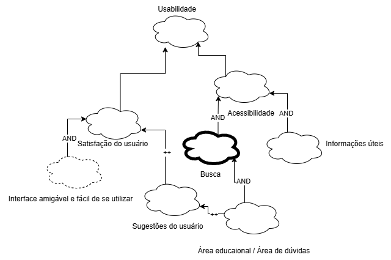
 
<b>Fonte:</b> [Pedro Camilo](https://github.com/PedrooCamilo)

Com prapagação de impactos:

<b> Figura 1:</b> Propagação de Impactos.
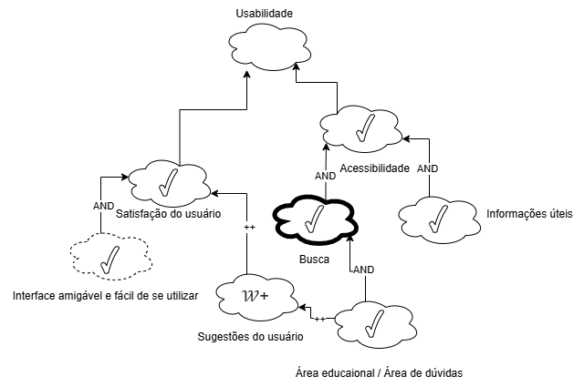
 
<b>Fonte:</b> [Pedro Camilo](https://github.com/PedrooCamilo)

## 2. Acessibilidade

#### SIG de Acessibilidade

Na figura monstra o SIG de Acessibilidade 

<b> Figura 1:</b> SIG-Acessibilidade

 
<b>Fonte:</b> miro

Na tabela 2 temos os requisitos não funcionais de acessibilidade 

<b>Tabela 2:</b>requisitos não funcionais de acessibilidade 

| Código | Requisito |
|--------|-----------|
| RNF05 | Acessibilidade (fonte grande, contraste, modo noturno) |
| RNF06 | Leitor de tela e assistente por voz para pessoas cegas |
| RNF11 | Acessibilidade para diferentes perfis de usuários |
| RNF13 | Texto com fontes ajustáveis e botões grandes |
| RNF14 | Interface adaptada para idosos e iniciantes *(também em Usabilidade)* |

Fonte: [Giovana Barbosa](https://github.com/gio221) , 2025.

#### Cartões de Especificação:

Na tabela 3 temos o requisito não funcional 05

<b>Tabela 2:</b>requisito não funcional 05 

|                  Item                   |                                                                      Descrição                                                                       |
| :-------------------------------------: | :--------------------------------------------------------------------------------------------------------------------------------------------------: |
| **Nr Requisito** RNF05 |                                       **Classificação**: Acessibilidade Visualcatálogo                                        |
|              **Descrição**              |                                                  O sistema deve permitir uso de fontes grandes, oferecer modo noturno e garantir contraste elevado.         |
|            **Justificativa**            |                                                 Usuários com baixa visão ou sensibilidade à luz precisam de recursos que tornem a leitura confortável.             |
|               **Origem**                |                                               BS17                   |
|        **Critério de Aceitação**        |                                    Conformidade com WCAG 2.1 (nível AA); modo noturno ativável; ajuste de tamanho de fonte ≥ 3 níveis   |
|            **Dependências**             |                                                           RNF13, RNF14              |
|             **Prioridade**              |9|
|              **Conflitos**              |                     Possível conflito com design minimalista padrão    |
|              **História**               |                                                      Criado em 01/06/2025       |

Fonte: [Giovana Barbosa](https://github.com/gio221) , 2025.

Na tabela 4 temos o requisito não funcional 06

<b>Tabela 2:</b>requisito não funcional 06 

|                  Item                   |                                                                      Descrição                                                                       |
| :-------------------------------------: | :--------------------------------------------------------------------------------------------------------------------------------------------------: |
| **Nr Requisito** RNF06 |                                       **Classificação**:  Acessibilidade Auditiva e Visual                                   |
|              **Descrição**              |                 O sistema deve ser compatível com leitores de tela e possuir assistente por voz funcional.      |
|            **Justificativa**            |               Essencial para usuários cegos ou com baixa visão total.          |
|               **Origem**                |                                            BS18                  |
|        **Critério de Aceitação**        |                                 Compatibilidade com NVDA e VoiceOver; feedback auditivo completo das ações  |
|            **Dependências**             |                                                        RNF11            |
|             **Prioridade**              | 10|
|              **Conflitos**              |                   Nenhum identificado  |
|              **História**               |                                                      Criado em 01/06/2025       |

Fonte: [Giovana Barbosa](https://github.com/gio221) , 2025.

Na tabela 5 temos o requisito não funcional 11

<b>Tabela 2:</b>requisito não funcional 11 

|                  Item                   |                                                                      Descrição                                                                       |
| :-------------------------------------: | :--------------------------------------------------------------------------------------------------------------------------------------------------: |
| **Nr Requisito** RNF11|                                       **Classificação**:  Acessibilidade Geral   |
|              **Descrição**              |           O sistema deve suportar múltiplos perfis de usuários com diferentes limitações cognitivas, motoras e visuais.      |
|            **Justificativa**            |      Aumenta a inclusão digital e atende normas legais.           |
|               **Origem**                |                                              IS09                  |
|        **Critério de Aceitação**        |     Suporte a navegação por teclado, linguagem simplificada e suporte a múltiplos modos sensoriais (visual, sonoro)  |
|            **Dependências**             |                                                         RNF06, RNF13             |
|             **Prioridade**              |10|
|              **Conflitos**              |                    Nenhum identificado    |
|              **História**               |                                                      Criado em 01/06/2025       |

Fonte: [Giovana Barbosa](https://github.com/gio221) , 2025.

Na tabela 6 temos o requisito não funcional 13

<b>Tabela 2:</b>requisito não funcional 13 

|                  Item                   |                                                                      Descrição                                                                       |
| :-------------------------------------: | :--------------------------------------------------------------------------------------------------------------------------------------------------: |
| **Nr Requisito** RNF13 |                                       **Classificação**: Acessibilidade Visual e Motora         |
|              **Descrição**              |                                      O sistema deve permitir ajuste do tamanho das fontes e botões com área de toque ampliada.     |
|            **Justificativa**            |                 Facilita o uso por idosos e pessoas com dificuldades motoras ou visuais.        |
|               **Origem**                |                                Storytelling - Olavo                |
|        **Critério de Aceitação**        |             Fontes ajustáveis em 3 níveis |
|            **Dependências**             |                                                           RNF05, RNF14             |
|             **Prioridade**              |8|
|              **Conflitos**              |                     Pode afetar o layout responsivo em telas menores   |
|              **História**               |                                                      Criado em 01/06/2025       |

Fonte: [Giovana Barbosa](https://github.com/gio221) , 2025.

Na tabela 7 temos o requisito não funcional 14

<b>Tabela 7 :</b>requisito não funcional 14 

|                  Item                   |                                                                      Descrição                                                                       |
| :-------------------------------------: | :--------------------------------------------------------------------------------------------------------------------------------------------------: |
| **Nr Requisito** RNF14 |                                       **Classificação**: Acessibilidade Cognitiva / Usabilidade          |
|              **Descrição**              |                                         A interface deve ser simplificada, clara e com instruções visuais para facilitar o uso por idosos e iniciantes.      |
|            **Justificativa**            |                     Reduz barreiras de entrada para novos usuários ou com pouca familiaridade tecnológica.   |
|               **Origem**                |                               Storytelling - Olavo, Marina                 |
|        **Critério de Aceitação**        |                             Testes com idosos resultando em taxa de sucesso > 80% nas tarefas básicas  |
|            **Dependências**             |                                                       RNF05, RNF13             |
|             **Prioridade**              |9|
|              **Conflitos**              |                     Pode conflitar com usuários avançados que desejam personalização ou funções avançadas   |
|              **História**               |                                                      Criado em 01/06/2025       |

Fonte: [Giovana Barbosa](https://github.com/gio221) , 2025.

#### Propagação de Impactos
Na tabela 8 temos a propagação de impactos da acessibilidade 

<b>Tabela 8:</b>requisito não funcional 14 

| NFR                                                                 | Impacto | Avaliador         |
|----------------------------------------------------------------------|---------|--------------------|
| O sistema deve ser capaz de montar uma atividade de forma fácil      | 𝒲++     | [Giovana Barbosa](https://github.com/gio221)  |
| O sistema deve ser claro de forma que o usuário possa entender e realizar uma tarefa sem dificuldades | 𝒲+      | [Giovana Barbosa](https://github.com/gio221)  |
| Capacidade de Aprendizado                                            | 𝒲++     | [Giovana Barbosa](https://github.com/gio221) |
| Adaptabilidade                                                       | 𝒲+      | [Giovana Barbosa](https://github.com/gio221)  |
| Proteção contra os erros                                             | X       | [Giovana Barbosa](https://github.com/gio221) |
| Intuitivo                                                            | X       | [Giovana Barbosa](https://github.com/gio221) |
| Usabilidade                                                          | 𝒲++     | [Giovana Barbosa](https://github.com/gio221)  |

Fonte: [Giovana Barbosa](https://github.com/gio221) , 2025.

#### Validação com o usuário

No video abaixo é feito a validação da parte de acessibilidade pela integrante [Giovana Barbosa](https://github.com/gio221) com a usuária Débora

<iframe width="560" height="315" src="https://www.youtube.com/embed/xKJIMlwFndg" title="YouTube video player" frameborder="0" allow="accelerometer; autoplay; clipboard-write; encrypted-media; gyroscope; picture-in-picture; web-share" referrerpolicy="strict-origin-when-cross-origin" allowfullscreen></iframe>

<a href=" https://youtu.be/xKJIMlwFndg" target="blanket">Vídeo da= validação com o usuário</a>

##  3. Desempenho e Eficiência

Tempo de resposta, leveza do app e uso eficiente de recursos.

| Código | Requisito |
|--------|-----------|
| [RNF10](../../Elicitação/Tecnicas-de-elecitação/requisitos-elicitados.md#requisitos-não-funcionais) | Carregamento rápido das páginas |
| [RNF15](../../Elicitação/Tecnicas-de-elecitação/requisitos-elicitados.md#requisitos-não-funcionais) | Aplicativo leve e com baixo consumo de dados |
| [RNF16](../../Elicitação/Tecnicas-de-elecitação/requisitos-elicitados.md#requisitos-não-funcionais) | Tempo de resposta inferior a 2 segundos |

**Cartão 1 -** RNF10.

|                  Item                |                           Descrição          |
| :-------------------------------------: | :--------------------------------------------: |
| **Nr Requisito:** RNF10 |                     **Classificação**: Desempenho/Eficiência              |
|              **Descrição**              | O sistema deve carregar as páginas rapidamente                 |
|            **Justificativa**            |        Responsividade evita reclamações do usuário, garantindo que o aplicativo será usado mais vezes.               |
|               **Origem**                |     Introspecção                                   |
|        **Critério de Aceitação**        |    O sistema deve carregar a página em menos de 5 segundos        |
|            **Dependências**             |    RNF16(Tempo de resposta inferior a 2 segundos)         |
|             **Prioridade**              | 5 |
|              **Conflitos**              | Pode gerar conflitos com requisitos de portabilidade, pois a velocidade de carregamento varia entre dispositivos                     |
|              **História**               |     Criado em: 01/06/2025. Última modificação em: 01/06/2025         |

**Cartão 2 -** RNF15.

|                  Item                |                           Descrição          |
| :-------------------------------------: | :--------------------------------------------: |
| **Nr Requisito:** RNF15 |                     **Classificação**: Desempenho/Eficiência              |
|              **Descrição**              | O sistema deve gerar um aplicativo leve e com baixo consumo de dados      |
|            **Justificativa**            |    Um aplicativo leve permite que o usuário não se incomode em baixá-lo, assim como o baixo consumo de dados      |
|               **Origem**                |     Storytelling - Diego              |
|        **Critério de Aceitação**        |    O aplicativo deve ter menos de 70 MB de armazenamento e consumir menos de 50 MB de dados móveis ao mês       |
|            **Dependências**             |    RNF16(Tempo de resposta inferior a 2 segundos) e RNF10(carregamento rápido de páginas)        |
|             **Prioridade**              | 5 |
|              **Conflitos**              | Pode gerar conflitos com requisitos de custo e qualidade, pois o armazenamento e o consumo de dados pode gerar um aplicativo mais investimento ou menor qualidade.                    |
|              **História**               |     Criado em: 01/06/2025. Última modificação em: 01/06/2025         |

**Cartão 3 -** RNF16.

|                  Item                |                           Descrição          |
| :-------------------------------------: | :--------------------------------------------: |
| **Nr Requisito:** RNF16 |                     **Classificação**: Desempenho/Eficiência              |
|              **Descrição**              | O sistema deve responder ao usuário em menos de 2 segundos.               |
|            **Justificativa**            |        Responsividade evita reclamações do usuário, garantindo que o aplicativo será usado mais vezes.               |
|               **Origem**                |     Storytelling - Lucas             |
|        **Critério de Aceitação**        |    O sistema deve ter um tempo de resposta de menos de 2 segundos        |
|            **Dependências**             |    RNF10(Carregamento rápido das páginas)         |
|             **Prioridade**              | 5 |
|              **Conflitos**              | Pode gerar conflitos com requisitos de portabilidade e custo, pois a velocidade de carregamento varia entre dispositivos e tende a precisar de maiores investimentos                    |
|              **História**               |     Criado em: 01/06/2025. Última modificação em: 01/06/2025         |

### Propagação de Impactos

<b>Tabela x:</b>Requisito não funcional 10 

| NFR                                                                 | Impacto | Avaliador         |
|----------------------------------------------------------------------|---------|--------------------|
| RNF10 Carregamento rápido das páginas      | 𝒲++     | [Eric Akio](https://github.com/eric-kingu)  |
| O sistema deve carregar as páginas rapidamente | 𝒲+      | [Eric Akio](https://github.com/eric-kingu)  |
| Responsividade | ✓ | [Eric Akio](https://github.com/eric-kingu) |
| Portabilidade   | 🗲       | [Eric Akio](https://github.com/eric-kingu) |
| Desempenho    | ✓       | [Eric Akio](https://github.com/eric-kingu) |
| Proteção contra erros    | 𝒲++     | [Eric Akio](https://github.com/eric-kingu)  |
| Infraestrutura | 🗲 | [Eric Akio](https://github.com/eric-kingu) |

Fonte: [Eric Akio](https://github.com/eric-kingu) , 2025.

<b>Tabela x:</b>Requisito não funcional 15 

| NFR                                                                 | Impacto | Avaliador         |
|----------------------------------------------------------------------|---------|--------------------|
| RNF15 Aplicativo leve e com baixo consumo de dados      | 𝒲++     | [Eric Akio](https://github.com/eric-kingu)  |
| O sistema gera um aplicativo leve e com baixo consumo de dados | 𝒲+      | [Eric Akio](https://github.com/eric-kingu)  |
| Responsividade | ✓ | [Eric Akio](https://github.com/eric-kingu) |
| Custo | 🗲 | [Eric Akio](https://github.com/eric-kingu) |
| Portabilidade   | 🗲       | [Eric Akio](https://github.com/eric-kingu) |
| Desempenho    | ✓       | [Eric Akio](https://github.com/eric-kingu) |
| Proteção contra erros    | 𝒲++     | [Eric Akio](https://github.com/eric-kingu)  |
| Infraestrutura | 🗲 | [Eric Akio](https://github.com/eric-kingu) |

Fonte: [Eric Akio](https://github.com/eric-kingu) , 2025.

<b>Tabela 8:</b>Requisito não funcional 16 

| NFR                                                                 | Impacto | Avaliador         |
|----------------------------------------------------------------------|---------|--------------------|
| RNF16 Tempo de resposta inferior a 2 segundos     | 𝒲++     | [Eric Akio](https://github.com/eric-kingu)  |
| O sistema deve responder ao usuário em menos de 2 segundos | 𝒲+      | [Eric Akio](https://github.com/eric-kingu)  |
| Responsividade | ✓ | [Eric Akio](https://github.com/eric-kingu) |
| Portabilidade   | 🗲       | [Eric Akio](https://github.com/eric-kingu) |
| Desempenho    | ✓       | [Eric Akio](https://github.com/eric-kingu) |
| Proteção contra erros    | 𝒲++     | [Eric Akio](https://github.com/eric-kingu)  |
| Infraestrutura | 🗲 | [Eric Akio](https://github.com/eric-kingu) |

Fonte: [Eric Akio](https://github.com/eric-kingu) , 2025.

---

##  4. Segurança

Proteção de dados pessoais e veiculares.

| Código | Requisito |
|--------|-----------|
| RNF03 | Alta segurança no tratamento de dados pessoais e veiculares |

---

##  5. Confiabilidade e Disponibilidade

Continuidade do sistema e recuperação de falhas.

| Código | Requisito |
|--------|-----------|
| [RNF18](../../Elicitação/Tecnicas-de-elecitação/requisitos-elicitados.md#tabela-requisitos) | Disponibilidade do sistema 24/7 |
| [RNF19](../../Elicitação/Tecnicas-de-elecitação/requisitos-elicitados.md#tabela-requisitos) | Confiabilidade: recuperação de falhas e continuidade da navegação |

**Cartão 1 -** RNF18.

|            Item           |                                                                       Descrição                                                                      |
| :-----------------------: | :--------------------------------------------------------------------------------------------------------------------------------------------------: |
|      **Nr Requisito**     |                                                                         RNF19                                                                        |
|     **Classificação**     |                                            Requisito Não Funcional → Confiabilidade → Disponibilidade                                            |
|       **Descrição**       |      O sistema deve assegurar mecanismos de recuperação automática em caso de falhas e garantir a continuidade da navegação sem perda de dados.      |
|     **Justificativa**     |                 Evitar que falhas do sistema comprometam a experiência do usuário e causem perda de dados ou interrupção no serviço.                 |
|         **Origem**        |                           [Storytelling - Diego](../../Elicitação/Tecnicas-de-elecitação/Storytelling.md#story-diego)                        |
| **Critério de Aceitação** | O sistema deve conseguir se recuperar automaticamente de falhas em até 30 segundos; logs de falhas devem ser registrados e analisados periodicamente. |
|      **Dependências**     |                                   RNF18 (Disponibilidade)                                   |
|       **Prioridade**      |                                                                          10                                                                          |
|       **Conflitos**       | Pode gerar conflito com requisitos de simplicidade e custo, já que mecanismos de redundância e recuperação podem aumentar a complexidade do sistema. |
|        **História**       |                                                     Criado em: 31-05-2025; Última modificação: 31-05-2025                                                      |

Fonte: [João Lobo](https://github.com/joaolobo10) , 2025.

**Cartão 2 -** RNF19.

|            Item           |                                                                    Descrição                                                                    |
| :-----------------------: | :---------------------------------------------------------------------------------------------------------------------------------------------: |
|      **Nr Requisito**     |                                                                      RNF18                                                                      |
|     **Classificação**     |                                            Requisito Não Funcional → Confiabilidade → Disponibilidade                                           |
|       **Descrição**       |        O sistema deve estar disponível para acesso e uso contínuo, 24 horas por dia, 7 dias por semana, sem interrupções significativas.        |
|     **Justificativa**     | Garantir que os usuários possam acessar os serviços a qualquer momento, independentemente do horário, aumentando a confiabilidade e satisfação. |
|         **Origem**        |                              [Storytelling - Lucas](../../Elicitação/Tecnicas-de-elecitação/Storytelling.md#story-lucas)                             |
| **Critério de Aceitação** |                     Tempo médio de disponibilidade ≥ 99,9% mensal; manutenção programada comunicada com 48h de antecedência.                    |
|      **Dependências**     |                     RNF19 (Confiabilidade)                     |
|       **Prioridade**      |                                                                        9                                                                        |
|       **Conflitos**       |    Pode gerar conflito com requisitos de custo, pois alta disponibilidade pode exigir investimentos elevados em infraestrutura e redundância.   |
|        **História**       |                                                   Criado em: 31-05-2025; Última modificação: 31-05-2025                                                  |

Fonte: [João Lobo](https://github.com/joaolobo10) , 2025.

---

#### Propagação de Impactos

**Tabela 9 -** Requisito não funcional 18.

| **NFR Relacionado**                                        | **Impacto sobre RNF18 – Disponibilidade** | **Avaliador**                                           |
|------------------------------------------------------------|--------------------------------------------|---------------------------------------------------------|
| **RNF19 – Tolerância a Falhas**                            | ✓                                          | [João Lobo](https://github.com/joaolobo10)             |
| **Monitoramento e Logs**                                   | ✓                                          | [João Lobo](https://github.com/joaolobo10)             |
| **Capacidade de Escalabilidade**                           | 𝒲+                                         | [João Lobo](https://github.com/joaolobo10)             |
| **Redundância de Infraestrutura**                          | ✓                                          | [João Lobo](https://github.com/joaolobo10)             |
| **Balanceamento de Carga**                                  | ✓                                          | [João Lobo](https://github.com/joaolobo10)             |
| **Simplicidade**  *(O sistema deve ser simples e intuitivo em sua arquitetura e funcionamento)* | 🗲                                         | [João Lobo](https://github.com/joaolobo10)             |
| **Backup Contínuo**                                                  | 𝒲+                                           | [João Lobo](https://github.com/joaolobo10)             |
| **Custo**                                                  | X                                          | [João Lobo](https://github.com/joaolobo10)             |

Fonte: [João Lobo](https://github.com/joaolobo10) , 2025.

**Tabela 10 -** Requisito não funcional 19.

| **NFR Relacionado**                                        | **Impacto sobre RNF19 – Confiabilidade** | **Avaliador**                                           |
|------------------------------------------------------------|------------------------------------------------|---------------------------------------------------------|
| **RNF18 – Disponibilidade**                                | ✓                                              | [João Lobo](https://github.com/joaolobo10)             |
| **Monitoramento e Logs**                                   | ✓                                              | [João Lobo](https://github.com/joaolobo10)             |
| **Capacidade de Escalabilidade**                           | 𝒲+                                             | [João Lobo](https://github.com/joaolobo10)             |
| **Redundância de Infraestrutura**                          | ✓                                              | [João Lobo](https://github.com/joaolobo10)             |
| **Proteção contra erros**                                  | ✓                                              | [João Lobo](https://github.com/joaolobo10)             |
| **Simplicidade**  *(O sistema deve ser simples e intuitivo em sua arquitetura e funcionamento)* | 🗲                                             | [João Lobo](https://github.com/joaolobo10)             |
| **Custo**                                                  | X                                              | [João Lobo](https://github.com/joaolobo10)             |

Fonte: [João Lobo](https://github.com/joaolobo10) , 2025.

#### Sem Propagação de Impactos

**Figura 04:** NFR Disponibilidade Sem propagação de Impactos.

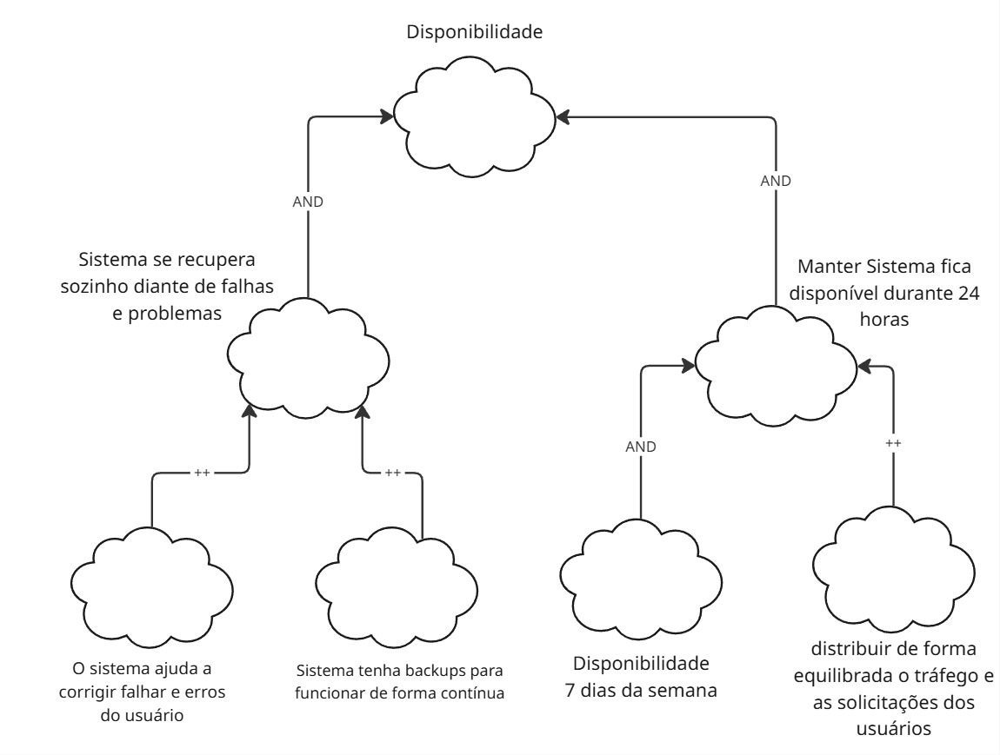

Fonte: [João Lobo](https://github.com/joaolobo10) , 2025.

**Figura 05:** NFR Confiabilidade Sem propagação de Impactos.

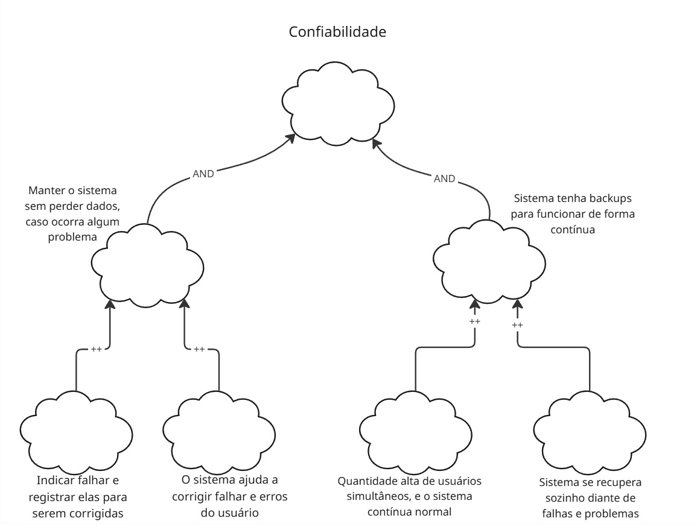

Fonte: [João Lobo](https://github.com/joaolobo10) , 2025.

#### Com Propagação de Impactos

**Figura 06:** NFR Disponibilidade Com propagação de Impactos.

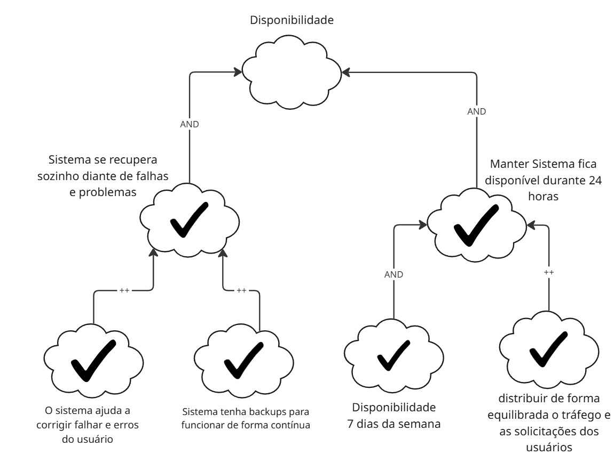

Fonte: [João Lobo](https://github.com/joaolobo10) , 2025.

**Figura 07:** NFR Confiabilidade Com propagação de Impactos.

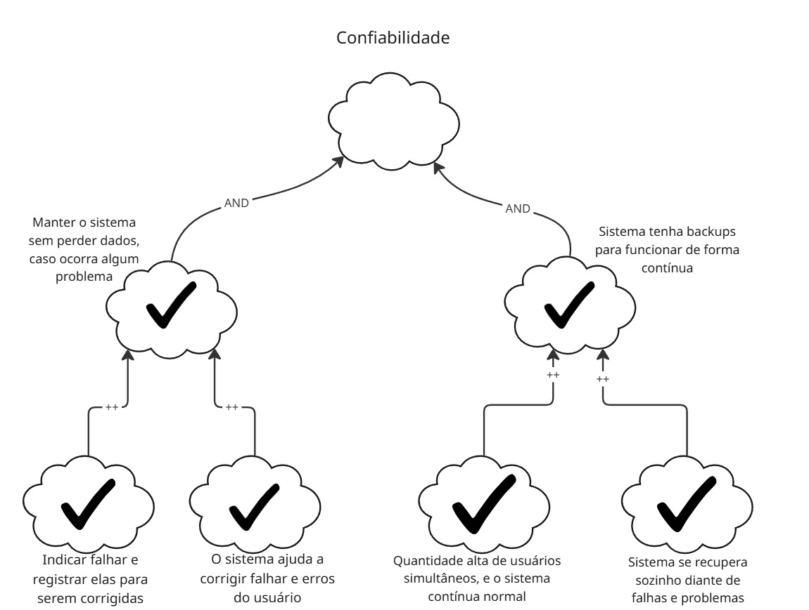

Fonte: [João Lobo](https://github.com/joaolobo10) , 2025.

#### Validação com o usuário

No video abaixo é feito a validação da parte de acessibilidade pelo integrante [João Lobo](https://github.com/joaolobo10) com a usuária do aplicativo Detran-DF Nicole Neves.

<iframe width="560" height="315" src="https://youtu.be/i3OqAIuV-1Y" title="YouTube video player" frameborder="0" allow="accelerometer; autoplay; clipboard-write; encrypted-media; gyroscope; picture-in-picture; web-share" referrerpolicy="strict-origin-when-cross-origin" allowfullscreen></iframe>

<a href="https://youtu.be/i3OqAIuV-1Y" target="blanket">Link do vídeo</a>

##  6. Portabilidade / Compatibilidade

#### SIG de compatibilidade

Na figura mostra o SIG de compatibilidade

<b> Figura x:</b> SIG-compatibilidade
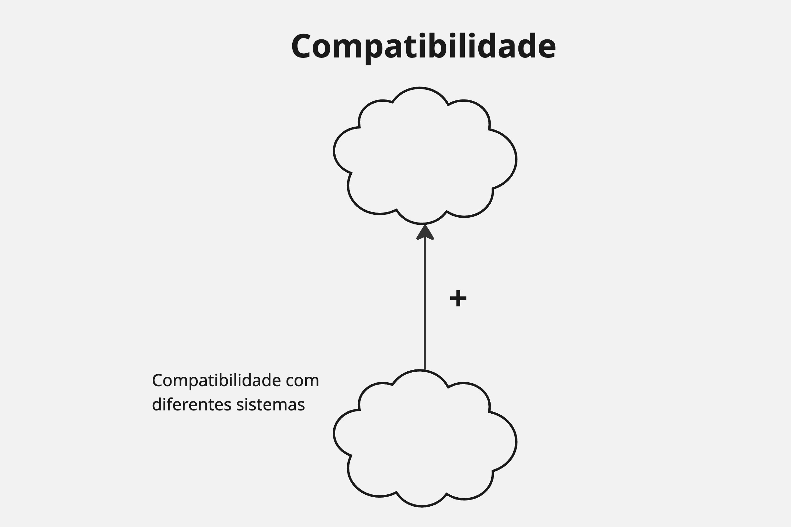
 
<b>Fonte:[Gabriel Mendes](https://github.com/gbevi) , 2025.</b> 

Na tabela x temos os requisitos não funcionais de portabilidade/compatibilidade

<b>Tabela x:</b>requisitos não funcionais de portabilidade/compatibilidade 

| Código | Requisito |
|--------|-----------|
| RNF02 | Compatibilidade com diferentes dispositivos e sistemas |

Fonte: [Gabriel Mendes](https://github.com/gbevi) , 2025.

Na tabela x temos o cartão de especificação do requisito RNF02.

<b>Tabela X:</b> Cartão de Especificação do Requisito RNF02

|                  Item                   |                                                                                     Descrição                                                                                     |
| :-------------------------------------: | :--------------------------------------------------------------------------------------------------------------------------------------------------------------------------------: |
| **Nr Requisito**                       | RNF02                                                                                                                                                                              |
| **Classificação**                      | Portabilidade / Compatibilidade                                                                                                                                                   |
| **Descrição**                          | Compatibilidade com diferentes dispositivos e sistemas.                                                                                                                           |
| **Justificativa**                      | A diversidade de plataformas e dispositivos utilizados por usuárixs exige que o sistema funcione corretamente em todos os contextos de uso.                                       |
| **Origem**                             | BS14 e IS10                                                                                                                                                                        |
| **Critério de Aceitação**             | O sistema deve ser executável sem falhas nos sistemas operacionais IOS e Android.                        |
| **Dependências**                       | Uso de tecnologias responsivas e frameworks multiplataforma.                                                                                                                      |
| **Prioridade**                         | 9                                                                                                                                                                                  |
| **Conflitos**                          | Pode haver conflito com requisitos de desempenho em dispositivos com hardware limitado.                                                                                           |
| **História**                           | Criado em 01/06/2025                                                                                                                                            |

Fonte: [Gabriel Mendes](https://github.com/gbevi) , 2025.

# Propagação de Impactos

| Softgoal Fonte         | Softgoal Alvo              | Tipo de Impacto |
|------------------------|----------------------------|------------------|
| Multiplataforma        | Portabilidade              | ✓                |
| Responsividade         | Compatibilidade            | 𝒲+               |
| Suporte a navegadores  | Compatibilidade            | ✓                |
| Modularidade do sistema| Portabilidade              | 𝒲+               |
| Frameworks modernos    | Compatibilidade            | ✓                |

Fonte: [Gabriel Mendes](https://github.com/gbevi) , 2025.

#### Validação com o usuário

No video abaixo é feito a validação da parte de acessibilidade pelo integrante [Gabriel Mendes](https://github.com/gbevi) com a usuária Karinna.

<iframe width="560" height="315" src="https://www.youtube.com/embed/xKJIMlwFndg" title="YouTube video player" frameborder="0" allow="accelerometer; autoplay; clipboard-write; encrypted-media; gyroscope; picture-in-picture; web-share" referrerpolicy="strict-origin-when-cross-origin" allowfullscreen></iframe>

<a href=" https://youtu.be/xKJIMlwFndg" target="blanket">Vídeo da validação com o usuário</a>

---

##  7. Qualidade e Feedback

Relacionados à avaliação do sistema e comunicação com o público.

| Código | Requisito |
|--------|-----------|
| RNF07 | Sistema de avaliação com base em uso real (ex-alunos) |
| RNF08 | Propaganda efetiva para promover o app |

---
Na figura monstra o SIG de Qualidade e Feedback 

<b> Figura 10:</b> SIG-Qualidade e feedback

 
<b>Fonte:</b> [Luiz Bessa](https://github.com/lfelipebessa), 2025

---
Na figura monstra o SIG referente a Qualidade e Feedback do aplicativo Detran-DF, com a propagação.

<b> Figura 11:</b> SIG-Qualidade e feedback

 
<b>Fonte:</b> [Luiz Bessa](https://github.com/lfelipebessa), 2025

---

### Cartão 5 – RNF07  

|            Item           | Descrição |
|---------------------------|-----------|
| **Nr Requisito**          | **RNF07** |
| **Classificação**         | Requisito Não Funcional → Qualidade e Feedback → Avaliação do usuário |
| **Descrição**             | O sistema deve disponibilizar mecanismo de avaliação *in-app* (1 a 5 estrelas) após a conclusão de serviços chave, permitindo comentários opcionais. |
| **Justificativa**         | Capturar percepção real de qualidade, priorizar melhorias e aumentar a confiabilidade pública do app. |
| **Origem**                | Stakeholders; boas práticas de UX; diretrizes Google Play / App Store. |
| **Critério de Aceitação** | • Solicitação de rating exibida **no máximo 1 vez/mês** por usuário. • Alcançar média ≥ 4,5 estrelas após 6 meses. • Comentários sincronizados com a loja correspondente. |
| **Dependências**          | RNF17 (Feedback visual/sonoro) – usado no prompt; RNF10 (Carregamento rápido) para não atrasar a tela de rating. |
| **Prioridade**            | 8 |
| **Conflitos**             | Pode conflitar com Usabilidade se o prompt for intrusivo; mitigar exibindo só após tarefa concluída. |
| **História**              | Criado: 31-05-2025   Última mod.: 31-05-2025 |

Fonte: <a href="https://github.com/lfelipebessa">Luiz Bessa</a>, 2025.

---

### Cartão 6 – RNF08  

|            Item           | Descrição |
|---------------------------|-----------|
| **Nr Requisito**          | **RNF08** |
| **Classificação**         | Requisito Não Funcional → Qualidade e Feedback → Promoção e Divulgação |
| **Descrição**             | O sistema deve oferecer mecanismos de divulgação (banner interno, push direcionado, redes sociais) para aumentar adesão dos usuários e divulgar novos serviços. |
| **Justificativa**         | Ampliar base de usuários e conscientizar sobre funcionalidades que reduzem filas presenciais. |
| **Origem**                | Stakeholders (Marketing DETRAN-DF). |
| **Critério de Aceitação** | • Push **não-promocional** limitado a 1 envio/semana. • Taxa de *opt-out* ≤ 20 %. • Campanhas internas carregam em < 300 ms. |
| **Dependências**          | RNF01 (Interface intuitiva) – posicionamento dos banners; RNF10 (Desempenho) – carregamento rápido das campanhas. |
| **Prioridade**            | 6 |
| **Conflitos**             | Pode impactar Usabilidade (clutter) e Desempenho; mitigado por regras de frequência e cache local. |
| **História**              | Criado: 31-05-2025   Última mod.: 31-05-2025 |

Fonte: <a href="https://github.com/lfelipebessa">Luiz Bessa</a>, 2025.

---
### Propagação de Impactos
### Tabela QF-01 – Propagação de Impactos do **RNF07**  
*Sistema de avaliação in-app baseado no uso real*

| Soft-goal / Elemento do SIG (Qualidade & Feedback) | Impacto | Avaliador |
|----------------------------------------------------|:-------:|-----------|
| Área de avaliação **autoescolas**                  | ✓       | Luiz Bessa |
| Formulário para avaliar **autoescolas**            | 𝒲+      | Luiz Bessa |
| Formulário para avaliar **instrutores**            | 𝒲+      | Luiz Bessa |
| Área de avaliação **aplicativo (Play / App Store)**| ✓       | Luiz Bessa |
| Formulário para avaliar **o aplicativo**           | 𝒲++     | Luiz Bessa |
| Usuário deve se sentir **seguro ao avaliar**       | ✓       | Luiz Bessa |
| **Opção de avaliação anônima**                     | 𝒲+      | Luiz Bessa |
| **Evitar manipulação** das avaliações              | 𝒲++     | Luiz Bessa |
| Validação interna                                  | 𝒲+      | Luiz Bessa |
| Usuário só pode **avaliar 1 vez**                  | ✓       | Luiz Bessa |

Fonte: <a href="https://github.com/lfelipebessa">Luiz Bessa</a>, 2025.

---

### Tabela QF-02 – Propagação de Impactos do **RNF08**  
*Propaganda e divulgação eficazes dentro do aplicativo*

| Soft-goal / Elemento do SIG (Qualidade & Feedback)  | Impacto | Avaliador |
|-----------------------------------------------------|:-------:|-----------|
| **Banner** interno de divulgação                    | 𝒲++     | Luiz Bessa |
| **Push** direcionado (informativo, não intrusivo)   | 𝒲+      | Luiz Bessa |
| Compartilhar em **redes sociais**                   | 𝒲+      | Luiz Bessa |
| Métrica de **adesão / instalação**                  | ✓       | Luiz Bessa |
| Respeitar limite de **frequência** (1 vez/semana)   | ✓       | Luiz Bessa |
| Conteúdo **acessível** (texto alternativo, contraste)| 𝒲+     | Luiz Bessa |
| Evitar **clutter** (sobrecarregar a UI)             | 𝒲-      | Luiz Bessa |
| Tempo de **carregamento** de campanhas              | 𝒲-      | Luiz Bessa |
| **Opt-out** fácil e visível                         | ✓       | Luiz Bessa |
| Monitorar **taxa de rejeição** da campanha          | 𝒲+      | Luiz Bessa |

Fonte: <a href="https://github.com/lfelipebessa">Luiz Bessa</a>, 2025.

---
## Histórico de versão

| Versão |    Data    |              Descrição              |                     Autor                     | Revisor |
| :----: | :--------: | :---------------------------------: | :-------------------------------------------: | :-----: |
|  1.0   | 20/05/2025 |       Início da documentação        | [Giovana Barbosa ](https://github.com/gio221) | [João Lobo](https://github.com/joaolobo10) |
|  1.1   | 20/05/2025 |       Iintrodução, objetivo, meotodologia, cartões de especificação        | [Giovana Barbosa ](https://github.com/gio221) | [João Lobo](https://github.com/joaolobo10) |
|  1.2   | 31/05/2025 |       Adição de cartões para RNF03, 18 e 19, criação de cartão para Disponbilidade e Confiabilidade        | [João Lobo](https://github.com/joaolobo10) | [Luiz Bessa](https://github.com/lfelipebessa) |
|  1.3   | 31/05/2025 |       Adição de cartões para RNF07 e 08 criação de cartão para Qualidade e Feedback | [Luiz Bessa](https://github.com/lfelipebessa) |[Giovana Barbosa ](https://github.com/gio221) |
|  1.4  | 31/05/2025 |       Adição de cartões para acessibilidade, SIG e a Propragação de impactos: | [Giovana Barbosa ](https://github.com/gio221) | [João Lobo](https://github.com/joaolobo10), [Luiz Bessa](https://github.com/lfelipebessa) |
|  1.5  | 31/05/2025 |  Adição de seção SIG, Interdependências. decomposições, contribuições além das figuras juntamente as seções, além disso adicionei para as RNF18 e 19, as tabelas de propagação de impactos.      | [João Lobo](https://github.com/joaolobo10) | [Luiz Bessa](https://github.com/lfelipebessa) |
|  1.6  | 01/06/2025 |       Adição SIG Qualidade e Feedback | [Luiz Bessa](https://github.com/lfelipebessa) | [João Lobo](https://github.com/joaolobo10) |
|  1.7  | 01/06/2025 |       Adição Propagação de impactos RNF08 e 07 | [Luiz Bessa](https://github.com/lfelipebessa) | [João Lobo](https://github.com/joaolobo10)|
|  1.8  | 01/06/2025 |       Adição SIG com propagação QF | [Luiz Bessa](https://github.com/lfelipebessa) | [João Lobo](https://github.com/joaolobo10)|
|  1.6  | 01/06/2025 |       Adição SIG Qualidade e Feedback | [Luiz Bessa](https://github.com/lfelipebessa) | [Pedro Camilo ](https://github.com/PedrooCamilo) |
|  1.7  | 01/06/2025 |       Adição Propagação de impactos RNF08 e 07 | [Luiz Bessa](https://github.com/lfelipebessa) |[Pedro Camilo ](https://github.com/PedrooCamilo) |
|  1.8  | 01/06/2025 |       Adição SIG com propagação QF | [Luiz Bessa](https://github.com/lfelipebessa) | [Pedro Camilo ](https://github.com/PedrooCamilo) |
|  1.9  | 01/06/2025 |       Adição de vídeo de validação com o usuário da RNF 18 e 19 | [João Lobo](https://github.com/joaolobo10) | |
|  2.0  | 01/06/2025 |       Adição de cartões para RNF02 e propagação de impacto, SIG de portabilidade/compatibilidade | [Gabriel Mendes](https://github.com/gbevi) | |
|  2.1  | 01/06/2025 |       Adição de cartões para usabilidade, SIG e a Propragação de impactos | [Pedro Camilo ](https://github.com/PedrooCamilo) | [Eric Akio](https://github.com/eric-kingu) |
| 2.2 | 01/06/2025 | Adição de cartões para desempenho e eficiência e propagação de impactos | [Eric Akio](https://github.com/eric-kingu) |  |
| 2.3 | 01/06/2025 | Adição de imagens das Softgoals de com e sem propagação de impactos, das RNF Disponibilidade e Confiabilidade | [João Lobo](https://github.com/joaolobo10) |  |