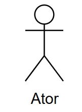
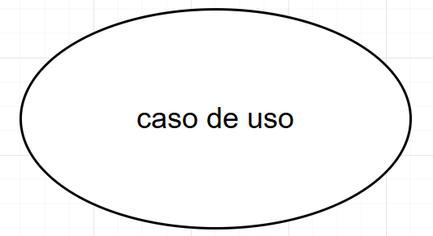
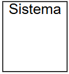
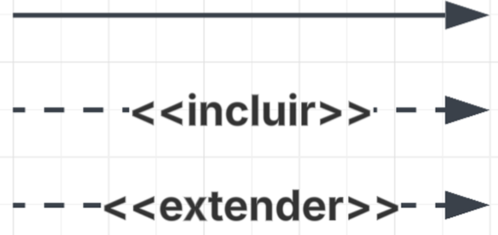
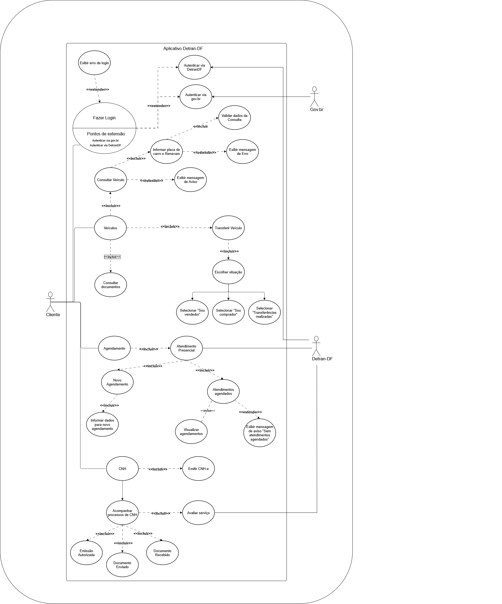

# Introdução

O Caso de Uso é um artefato essencial na Engenharia de Requisitos, utilizado para descrever as interações entre os usuários e o sistema. No contexto do aplicativo Detran-DF, ele permite representar de forma clara como os cidadãos interagem com os serviços digitais oferecidos, como agendamentos, emissão de documentos, consulta de débitos, entre outros. Essa abordagem ajuda a alinhar a visão dos stakeholders com a implementação técnica.

# Objetivo

O objetivo do Caso de Uso no projeto do Detran-DF é representar detalhadamente os requisitos funcionais, considerando diferentes fluxos de interação com o sistema. Ele busca garantir que o sistema atenda às necessidades dos usuários, oferecendo uma visão centrada no cidadão e auxiliando no desenvolvimento, testes e rastreabilidade dos requisitos ao longo do ciclo de vida do projeto.

# Metodologia

A construção dos Casos de Uso para o aplicativo Detran-DF segue uma abordagem estruturada com as seguintes etapas:

1. **Identificação da funcionalidade** a ser modelada e definição dos atores envolvidos.
2. **Descrição dos atores e pré-condições**, especificando quem pode iniciar a interação e quais condições devem ser cumpridas.
3. **Modelagem dos fluxos**, com a criação de:
   - Fluxo principal (sucesso);
   - Fluxos alternativos (variações);
   - Fluxos de exceção (falhas ou erros).
4. **Definição de pós-condições**, descrevendo os resultados após a execução do caso.
5. **Validação com stakeholders**, garantindo clareza, completude e alinhamento com os objetivos do sistema.

Essa metodologia assegura que os Casos de Uso representem corretamente o comportamento do sistema Detran-DF, servindo como base para todas as fases do desenvolvimento.

No diagrama de caso de uso , precisamos ter todos esses componentes:

**Tabela 1 -** Componentes de um diagrama de caso de uso.

| **Símbolo**                                                 | **Nome**        | **Função**                                                                                                                                                                                                                                                                                                                                                                                                                                                                                                                                    |
| ----------------------------------------------------------- | --------------- | --------------------------------------------------------------------------------------------------------------------------------------------------------------------------------------------------------------------------------------------------------------------------------------------------------------------------------------------------------------------------------------------------------------------------------------------------------------------------------------------------------------------------------------------- |
|            | **Ator**        | Atores representam algo ou alguém que utiliza o sistema para atingir um objetivo, podendo ser uma pessoa, organização, outro sistema ou dispositivo externo. Atores são objetos externos, que serão representados fora dos limites do projeto. Os atores também podem ser dividos em atores primários e secundários, os primários são aqueles que iniciam a utilização do sistema, que são representados do lado esquerdo do diagrama, e os secundários são os atores que reagem a uma certa ação, representados do lado direito do diagrama. |
|  | **Caso de Uso** | Representa uma ação que realiza uma tarefa dentro do sistema, são representados dentro do retângulo do sistema pois são funcionalidades realizadas pelo projeto que está sendo implementado.                                                                                                                                                                                                                                                                                                                                                  |
|      | **Sistema**     | Projeto que está sendo desenvolvido. O retângulo que abrange o sistema representa os limites do projeto, o que ele deve realizar, separando os casos de uso, que podem ficar dentro do sistema, dos atores, que devem ficar do lado de fora do retângulo.                                                                                                                                                                                                                                                                                     |
|          | **Relações**    | A seta contínua representa a associação direta entre um ator e um caso de uso. As setas tracejadas com o estereótipo <<incluir>> indicam que um caso de uso sempre inclui outro de forma obrigatória. Já as setas com <<extender>> indicam que um caso de uso pode opcionalmente estender o comportamento de outro, dependendo de certas condições.       |

Fonte: [João Lobo](https://github.com/joaolobo10) , 2025.

## Diagrama de Caso de Uso do app Detran-DF

**Figura 1 -** Diagrama de Casos de Uso.

Acesse a imagem nesse [link](https://drive.google.com/drive/folders/1pf7yX20jniQRjWgEHnimCxhAAKzyBHg6?usp=drive_link)

Fonte: [João Lobo](https://github.com/joaolobo10), [Giovana Barbosa](https://github.com/gio221), 2025.

## Especificação do Caso de Uso

A especificação dos casos de uso é uma técnica utilizada para descrever detalhadamente as interações entre os usuários e o sistema. Ela documenta os passos seguidos em cada caso de uso, incluindo os eventos que desencadeiam a interação, as ações realizadas e as respostas esperadas do sistema.

A tabela 2 descreve qual funcionalidade cada integrante fez um caso de uso.

**Tabela 2 -** Divisão de caso de uso por integrantes da equipe.

| Responsável                                   | Funcionalidades                                                                                      |
| -------------------------------------------- | ---------------------------------------------------------------------------------------------------- |
| [Giovana Barbosa](https://github.com/gio221) | [UC01 - Realizar agendamentos presenciais](https://requisitos-de-software.github.io/2025.1-DetranDF/modelagem/caso-de-uso/#uc1)  [UC02 - Sistema de pagamento de taxas e débitos](https://requisitos-de-software.github.io/2025.1-DetranDF/modelagem/caso-de-uso/#uc2)          |
| [João Lobo](https://github.com/joaolobo10)   | [UC03 - Chat com IA para tirar dúvidas](https://requisitos-de-software.github.io/2025.1-DetranDF/modelagem/caso-de-uso/#uc3)  [UC04 - Atendimento ao vivo com servidor do DETRAN](https://requisitos-de-software.github.io/2025.1-DetranDF/modelagem/caso-de-uso/#uc4)          |
| [Gabriel Mendes](https://github.com/gbevi)   | [UC05 - Integração com CNH digital](https://requisitos-de-software.github.io/2025.1-DetranDF/modelagem/caso-de-uso/#uc5)  [UC06 - Opção para adicionar quilometragem do seu carro](https://requisitos-de-software.github.io/2025.1-DetranDF/modelagem/caso-de-uso/#uc6)         |
| [Luiz Bessa](https://github.com/lfelipebessa)| [UC07 - Histórico de Pesquisas e Serviços Recentes](https://requisitos-de-software.github.io/2025.1-DetranDF/modelagem/caso-de-uso/#uc7)  [UC08 - Notificação antecipada da data de vencimento da CNH](https://requisitos-de-software.github.io/2025.1-DetranDF/modelagem/caso-de-uso/#uc8) |
| [Pedro Camilo](https://github.com/PedrooCamilo) | [UC09 - Área educacional com explicações e vídeos](https://requisitos-de-software.github.io/2025.1-DetranDF/modelagem/caso-de-uso/#uc9)  [UC10 - Explicações acessíveis sobre siglas](https://requisitos-de-software.github.io/2025.1-DetranDF/modelagem/caso-de-uso/#uc10)     |
| [Maria Eduarda](https://github.com/maaduh)   | [UC11 - Notificação de multas e prazos com desconto](https://requisitos-de-software.github.io/2025.1-DetranDF/modelagem/caso-de-uso/#uc11)  [UC12 - Aviso automático em caso de roubo/recuperação do carro](https://requisitos-de-software.github.io/2025.1-DetranDF/modelagem/caso-de-uso/#uc12) |
| [Eric Akio](https://github.com/eric-kingu)   | [UC13 - Agendamento online para provas teóricas e práticas](https://requisitos-de-software.github.io/2025.1-DetranDF/modelagem/caso-de-uso/#uc13)  [UC14 - Acessibilidade para diferentes perfis de usuários](#uc14) |

Já na tabela 3 temos o modelo base usado em nossas especificações dos casos de uso.

**Tabela 3 -** Modelo de especificação de caso de uso.

| UCxx                  | Nome do caso de uso                                                                                                                                           |
| --------------------- | ------------------------------------------------------------------------------------------------------------------------------------------------------------- |
| **Descrição**         | Uma breve explicação do que o caso de uso faz ou descreve.                                                                                                    |
| **Atores**            | Os papéis ou entidades que interagem com o sistema.                                                                                                           |
| **Pré-condição**      | As condições que devem ser verdadeiras antes que o caso de uso possa ser iniciado.                                                                            |
| **Pós-condição**      | As condições que devem ser verdadeiras após a conclusão bem-sucedida do caso de uso.                                                                          |
| **Fluxo principal**   | A sequência de passos que descreve a interação típica entre o ator e o sistema para atingir o objetivo do caso de uso.                                        |
| **Fluxo alternativo** | Sequências de passos que ocorrem se condições específicas forem atendidas durante a execução do caso de uso, mas não são necessariamente o caminho principal. |
| **Fluxo de exceções** | Sequências de passos que descrevem como lidar com erros ou situações inesperadas durante a execução do caso de uso.                                           |

Fonte: [João Lobo](https://github.com/joaolobo10) , 2025.

### Requisitos Realizar agendamento de serviços

Abaixo, na tabela 4, está especificado o caso de uso para a funcionalidade de "Realizar agendamento de serviços".

**Tabela 4 -** Requisitos Realizar agendamento de serviços.

| UC01                  | Nome do caso de uso                                                                                                                                                                                                                                                                                                                                                                              |
| --------------------- | ------------------------------------------------------------------------------------------------------------------------------------------------------------------------------------------------------------------------------------------------------------------------------------------------------------------------------------------------------------------------------------------------ |
| **UC01**              | Realizar agendamento de serviços                                                                                                                                                                                                                                                                                                                                                                 |
| **Descrição**         | Este caso de uso descreve como o usuário realiza o agendamento de um serviço presencial (ex: vistoria, CNH, etc.) por meio da plataforma.                                                                                                                                                                                                                                                        |
| **Atores**            | Usuário (ator principal), Sistema                                                                                                                                                                                                                                                                                                                                                                |
| **Pré-condição**      | O usuário deve estar autenticado no sistema e ter acesso aos serviços disponíveis para agendamento.                                                                                                                                                                                                                                                                                              |
| **Pós-condição**      | Um agendamento é criado e armazenado no sistema. O usuário recebe uma confirmação com os detalhes do agendamento.                                                                                                                                                                                                                                                                                |
| **Fluxo principal**   | 1. O usuário acessa a área de agendamentos. 2. O sistema exibe os serviços disponíveis. 3. O usuário seleciona o serviço desejado. 4. O sistema apresenta os horários e locais disponíveis. 5. O usuário escolhe data, horário e local. 6. O sistema solicita confirmação. 7. O usuário confirma. 8. O sistema registra o agendamento e apresenta a confirmação ao usuário. |
| **Fluxo alternativo** |  - 3a. O usuário decide alterar o serviço selecionado: retorna à lista de serviços. - 5a. O horário selecionado está indisponível: o sistema exibe uma mensagem e solicita nova escolha.                                                                                                                                                                                                   |
| **Fluxo de exceções** | - E1. Falha de conexão com o sistema: exibir mensagem de erro e tentar nova conexão.  - E2. Dados obrigatórios não preenchidos: sistema alerta e impede a confirmação do agendamento.                                                                                                                                                                                                         |

Fonte: [Giovana Barbosa](https://github.com/gio221) , 2025.

### Sistema de pagamento de taxas e débitos

Abaixo, na tabela 5, está especificado o caso de uso para a funcionalidade de "Sistema de pagamento de taxas e débitos".

**Tabela 5 -** Sistema de pagamento de taxas e débitos.

| **Seção**               | **Descrição**                                                                                                                                                                                                                                                                                                                                                                                                                                                                    |
| ----------------------- | -------------------------------------------------------------------------------------------------------------------------------------------------------------------------------------------------------------------------------------------------------------------------------------------------------------------------------------------------------------------------------------------------------------------------------------------------------------------------------- |
| **ID**                  | UC02                                                                                                                                                                                                                                                                                                                                                                                                                                                                             |
| **Nome**                | Sistema de pagamento de taxas e débitos                                                                                                                                                                                                                                                                                                                                                                                                                                          |
| **Descrição**           | Este caso de uso descreve como o usuário acessa e realiza o pagamento de taxas e débitos vinculados aos seus serviços no sistema.                                                                                                                                                                                                                                                                                                                                                |
| **Atores**              | Usuário (ator principal), Sistema, Instituição financeira (ator secundário)                                                                                                                                                                                                                                                                                                                                                                                                      |
| **Pré-condição**        | O usuário deve estar autenticado no sistema e possuir débitos ou taxas pendentes.                                                                                                                                                                                                                                                                                                                                                                                                |
| **Pós-condição**        | O pagamento é processado e registrado no sistema. O usuário recebe um comprovante.                                                                                                                                                                                                                                                                                                                                                                                               |
| **Fluxo Principal**     | 1. O usuário acessa a seção de pagamentos.  2. O sistema exibe os débitos e taxas pendentes.  3. O usuário seleciona os itens que deseja pagar.  4. O sistema exibe o valor total e as formas de pagamento disponíveis.  5. O usuário escolhe a forma de pagamento (boleto, cartão, Pix, etc.).  6. O sistema redireciona para o ambiente seguro de pagamento.  7. O usuário realiza o pagamento.  8. O sistema confirma o pagamento e gera um comprovante. |
| **Fluxos Alternativos** | - **3a.** O usuário decide parcelar os débitos: o sistema apresenta as opções de parcelamento.   - **5a.** A forma de pagamento não está disponível: o sistema sugere alternativas.                                                                                                                                                                                                                                                                                           |
| **Fluxos de Exceção**   | - **E1.** Falha de conexão com o sistema de pagamento: exibir mensagem e oferecer tentativa posterior.   - **E2.** Pagamento recusado: notificar o usuário e manter os débitos como pendentes.                                                                                                                                                                                                                                                                                |

Fonte: [Giovana Barbosa](https://github.com/gio221) , 2025.

### Chat com IA para tirar dúvidas

Abaixo, na tabela 6, está especificado o caso de uso para a funcionalidade de "Chat com IA para tirar dúvidas".

**Tabela 6 -** Chat com IA para tirar dúvidas.

| UC03                  | Chat com IA para dúvidas gerais                                                                                                                                                                                                                                           |
| --------------------- | ------------------------------------------------------------------------------------------------------------------------------------------------------------------------------------------------------------------------------------------------------------------------- |
| **Descrição**         | Permite que o usuário tire dúvidas frequentes sobre os serviços do Detran DF através de uma IA integrada ao aplicativo, de forma prática e automatizada.                                                                                                                  |
| **Atores**            | Usuário do aplicativo, Assistente virtual (IA).                                                                                                                                                                                                                           |
| **Pré-condição**      | O usuário deve estar logado no aplicativo, possuir conexão com a internet e a IA e base de conhecimento devem estar ativas.                                                                                                                                               |
| **Pós-condição**      | O usuário recebe uma resposta adequada à sua dúvida ou é redirecionado para atendimento humano, se necessário.                                                                                                                                                            |
| **Fluxo principal**   | 1. O usuário acessa o aplicativo do Detran DF.  2. Clica na opção “Chat de dúvidas”.  3. A IA cumprimenta e oferece categorias de ajuda.  4. O usuário faz uma pergunta.  5. A IA responde com base na base de conhecimento.  6. O usuário encerra o chat. |
| **Fluxos alternativos** | - O usuário faz uma pergunta fora das categorias mostradas, e a IA tenta redirecioná-lo para uma categoria relevante.   - O usuário utiliza linguagem inadequada ou ofensiva: a IA emite um aviso de conduta e pode encerrar o atendimento após 3 infrações.   - O usuário solicita atendimento humano diretamente: a IA verifica disponibilidade e encaminha para um atendente, se possível.    - O usuário deseja salvar o histórico de conversa: a IA oferece opção de exportar via PDF ou e-mail.    - O usuário pergunta sobre um serviço temporariamente indisponível: a IA informa a indisponibilidade e sugere alternativas. |
| **Fluxos de exceção** | - A IA não entende a pergunta ou o assunto está fora do escopo: a IA informa que não pode ajudar e fornece contato humano.   - O limite diário de 10 interações é atingido: a IA informa o limite e sugere tentar no dia seguinte.   - Conexão com a internet é perdida durante o uso: o chat é interrompido e uma notificação orienta o usuário a verificar sua conexão.   - A IA está indisponível por manutenção: o sistema exibe aviso de indisponibilidade temporária e sugere canais alternativos de atendimento.   - O usuário não interage por mais de 5 minutos: a sessão é encerrada automaticamente com aviso de inatividade. |

Fonte: [João Lobo](https://github.com/joaolobo10) , 2025.

### Atendimento ao vivo com servidor do DETRAN via chat/vídeo

Abaixo, na tabela 7, está especificado o caso de uso para a funcionalidade de "Atendimento ao vivo com servidor do DETRAN via chat/vídeo".

**Tabela 7 -** Atendimento ao vivo com servidor do DETRAN via chat/vídeo.

| UC04                  | Atendimento ao vivo com servidor do Detran via chat/vídeo                                                                                                                                                                                                                                                                  |
| --------------------- | -------------------------------------------------------------------------------------------------------------------------------------------------------------------------------------------------------------------------------------------------------------------------------------------------------------------------- |
| **Descrição**         | Permite que o usuário realize atendimento remoto com um servidor do Detran DF, por chat, voz ou vídeo, em data e hora agendadas.                                                                                                                                                                                           |
| **Atores**            | Usuário do aplicativo, Servidor do Detran DF.                                                                                                                                                                                                                                                                              |
| **Pré-condição**      | O usuário deve estar logado, ter conexão com a internet, e já ter feito um agendamento válido.                                                                                                                                                                                                                             |
| **Pós-condição**      | O atendimento é realizado com sucesso e registrado no sistema.                                                                                                                                                                                                                                                             |
| **Fluxo principal**   | 1. O usuário acessa o app.  2. Navega até “Atendimento ao vivo”.  3. Escolhe o serviço e agenda o horário.  4. No dia e hora marcados, acessa o atendimento.  5. O servidor inicia o atendimento por vídeo.  6. O atendimento ocorre por vídeo, voz ou chat.  7. O atendimento é encerrado e registrado. |
| **Fluxos alternativos** | - O usuário opta por não ativar a câmera e é atendido apenas por voz ou chat.    - O servidor inicia o atendimento com atraso de até 5 minutos por questões operacionais.    - O usuário decide reagendar antes do horário marcado: o sistema permite uma remarcação com no mínimo 1 hora de antecedência.    - O atendimento começa por vídeo, mas é transferido para o chat por problemas técnicos com o microfone ou câmera.    - O servidor verifica que a solicitação do usuário não corresponde ao serviço agendado e o orienta a reagendar corretamente. |
| **Fluxos de exceções** | - O usuário não comparece no horário agendado: o atendimento é cancelado automaticamente após 10 minutos de tolerância.    - Instabilidade de conexão de qualquer das partes: o servidor pode remarcar automaticamente ou sugerir novo horário.   - Tentativa de acesso fora do horário agendado: o sistema bloqueia a conexão e exibe mensagem de erro.   - O servidor não está disponível no horário marcado: o sistema notifica o usuário e oferece reagendamento prioritário.    - O atendimento é interrompido por queda do sistema: o sistema registra o erro e envia confirmação ao usuário para reagendamento.    - O usuário se comporta de forma inadequada ou desrespeitosa: o servidor pode encerrar a sessão e o sistema registra o incidente. |
                                                                                          |

Fonte: [João Lobo](https://github.com/joaolobo10) , 2025.

### Integração com CNH Digital

Abaixo, na Tabela 8, está especificado o caso de uso para a funcionalidade **“Integração com CNH Digital”**.

**Tabela 8 –** Integração com CNH Digital e Gov BR.

| UC05                  | Integração com CNH Digital e Gov BR                                                                                                   |
|-----------------------|---------------------------------------------------------------------------------------------------------------------------------------|
| **Descrição**         | Permite que a pessoa usuária autentique-se via Gov BR (OAuth 2.0) e importe automaticamente os dados da sua CNH Digital para o app.   |
| **Atores**            | • Usuário do aplicativo • Serviço de Autenticação CNH digital • API SENATRAN (CNH Digital)                                           |
| **Pré-condição**      | • Usuário possui cadastro ativo na CNH Digital. • Dispositivo conectado à internet.                                                     |
| **Pós-condição**      | • Token JWT válido armazenado com segurança. • Dados da CNH sincronizados no perfil do usuário.                                    |
| **Fluxo principal**   | 1. Usuário seleciona “Entrar com CNH digital”. 2. Sistema redireciona para a tela de login CNH digital(OAuth 2.0). 3. Usuário autentica-se e concede consentimento. 4. Gov BR retorna *authorization code*. 5. Sistema troca o código por um token JWT. 6. Com o token, o sistema requisita dados da CNH na API SENATRAN. 7. Dados são armazenados e exibidos no aplicativo. 8. Caso de uso termina com usuário autenticado e CNH validada. |
| **Fluxo alternativo** | **A1 – Usuário já logado:** • Passo 1: sistema detecta sessão ativa. • Vai direto ao Passo 6.  **A2 – Consentimento negado:** • Passo 3: usuário nega consentimento. • Sistema exibe mensagem “Integração cancelada” e encerra. |
| **Fluxo de exceções** | **E1 – Falha na autenticação CNH digital:** • Sistema exibe erro e oferece tentar novamente.  **E2 – API SENATRAN indisponível:** • Sistema armazena token, agenda nova tentativa de sincronização e notifica usuário. |

Fonte: [Gabriel Dantas](https://github.com/gbevi), 2025.

### Opção para adicionar quilometragem do seu carro

Abaixo, na Tabela 9, está especificado o caso de uso para a funcionalidade **“Opção para adicionar quilometragem do seu carro”**.

**Tabela 9 –** Área para autoescolas com avaliações, comentários e localização.

| UC06                  | Opção para adicionar quilometragem do seu carro                                                                                                                 |
|-----------------------|----------------------------------------------------------------------------------------------------------------------------------------|
| **Descrição**         | Permite que usuários editem a quilometragem do carro cadastrado. |
| **Atores**            | • Usuário                                                  |
| **Pré-condição**      | • Carro cadastrado                                                         |
| **Pós-condição**      | • Edição registrada.                                                |
| **Fluxo principal**   | 1. Usuário acessa o seu carro cadastrado. 2. Edita a quilometragem. 4. Insere a quilometragem. 5. Sistema valida entrada e salva edição. 6. Edição aparece no app. |
| **Fluxo alternativo** | **A1 – Cancela edição:** • Passo 4: clica em cancelar. • Sistema não registra alterações. |
| **Fluxo de exceções** | **E1 – quilometragem neagtiva:** • Sistema bloqueia envio, exibe mensagem e oferece editar. |

Fonte: [Gabriel Dantas](https://github.com/gbevi), 2025.

### Histórico de Pesquisas e Serviços Recentes

Abaixo, na Tabela 10, está especificado o caso de uso para a funcionalidade de **"Histórico de Pesquisas e Serviços Recentes"**.

**Tabela 10 -** Histórico de Pesquisas e Serviços Recentes.

| UC07                  | Histórico de Pesquisas e Serviços Recentes                                                                                                                                                                                                                       |
| --------------------- | ---------------------------------------------------------------------------------------------------------------------------------------------------------------------------------------------------------------------------------------------------------------- |
| **Descrição**         | Permite ao usuário visualizar rapidamente os últimos serviços acessados ou pesquisas realizadas dentro do aplicativo, facilitando o acesso recorrente.                                                                                                           |
| **Atores**            | Usuário                                                                                                                                                                                                                                                          |
| **Pré-condição**      | O usuário deve estar autenticado no sistema e já ter realizado alguma ação como acessar um serviço ou realizar uma pesquisa.                                                                                                                                     |
| **Pós-condição**      | Os serviços ou pesquisas realizadas são salvos e exibidos em uma seção visível na tela inicial ou área de histórico.                                                                                                                                             |
| **Fluxo principal**   | 1. O usuário realiza o login. 2. O sistema verifica as ações mais recentes feitas pelo usuário. 3. O sistema armazena essas ações localmente ou no servidor. 4. Ao acessar o app novamente, o sistema exibe as últimas pesquisas ou serviços acessados. |
| **Fluxo alternativo** | 1a. Se o usuário não realizou nenhuma ação anterior, a seção de histórico estará vazia ou exibirá uma mensagem "Nenhum histórico encontrado".                                                                                                                    |
| **Fluxo de exceções** | 1e. Em caso de erro no carregamento do histórico, o sistema deve exibir uma mensagem de erro amigável e sugerir que o usuário tente novamente mais tarde.                                                                                                        |

Fonte: [Luiz Bessa](https://github.com/lfelipebessa), 2025.

---

### Notificação antecipada da data de vencimento da CNH

Abaixo, na Tabela 11, está especificado o caso de uso para a funcionalidade de **"Notificação antecipada da data de vencimento da CNH"**.

**Tabela 11 -** Notificação antecipada da data de vencimento da CNH.

| UC08                  | Notificação antecipada da data de vencimento da CNH                                                                                                                                                                                                                                                    |
| --------------------- | ------------------------------------------------------------------------------------------------------------------------------------------------------------------------------------------------------------------------------------------------------------------------------------------------------ |
| **Descrição**         | O sistema verifica periodicamente a data de vencimento da CNH registrada e envia uma notificação ao usuário com antecedência de 30 dias.                                                                                                                                                               |
| **Atores**            | Sistema (automação), Usuário                                                                                                                                                                                                                                                                           |
| **Pré-condição**      | O usuário deve ter uma CNH cadastrada no sistema com data de validade registrada.                                                                                                                                                                                                                      |
| **Pós-condição**      | O usuário recebe uma notificação push alertando sobre o vencimento próximo da CNH.                                                                                                                                                                                                                     |
| **Fluxo principal**   | 1. O sistema agenda uma verificação periódica das datas de vencimento da CNH. 2. O sistema identifica que a CNH do usuário vencerá em 30 dias. 3. O sistema envia uma notificação para o dispositivo do usuário. 4. O usuário visualiza a notificação e pode acessar mais informações no app. |
| **Fluxo alternativo** | 1a. Se a CNH já estiver vencida ou for inválida, o sistema não enviará a notificação.                                                                                                                                                                                                                  |
| **Fluxo de exceções** | 1e. Se houver falha no envio da notificação, o sistema registra o erro e tenta reenviar na próxima execução da rotina programada.                                                                                                                                                                      |

Fonte: [Luiz Bessa](https://github.com/lfelipebessa), 2025.

### Área educacional com explicações e vídeos

Abaixo, na tabela 12, está especificado o caso de uso para a funcionalidade de "Área educacional com explicações e vídeos".

**Tabela 12 -** Área educacional com explicações e vídeos.

| **Campo**             | **Descrição**                                                                                                                                                                                                                                                                                                        |
| --------------------- | -------------------------------------------------------------------------------------------------------------------------------------------------------------------------------------------------------------------------------------------------------------------------------------------------------------------- |
| **UC09**              | Área educacional com explicações e vídeos                                                                                                                                                                                                                                                                            |
| **Descrição**         | Este caso de uso descreve a interação do usuário com a área educacional do aplicativo do Detran-DF, onde é possível acessar vídeos e textos educativos sobre trânsito, legislação e cidadania no trânsito.                                                                                                           |
| **Atores**            | Usuário (cidadão), Sistema do Detran-DF                                                                                                                                                                                                                                                                              |
| **Pré-condição**      | O usuário deve estar com o aplicativo instalado e com acesso à internet.                                                                                                                                                                                                                                             |
| **Pós-condição**      | O usuário acessou, visualizou ou interagiu com os conteúdos educacionais da plataforma.                                                                                                                                                                                                                              |
| **Fluxo principal**   | 1. O usuário abre o aplicativo do Detran-DF.   2. O usuário navega até a “Área Educacional”.   3. O sistema exibe os temas disponíveis.   4. O usuário seleciona um tema.   5. O sistema apresenta vídeos e textos explicativos sobre o tema.   6. O usuário assiste aos vídeos ou lê as explicações. |
| **Fluxo alternativo** | A1. O usuário utiliza o campo de busca para encontrar um tema específico.   A2. O sistema exibe apenas os conteúdos relacionados ao termo buscado.                                                                                                                                                                |
| **Fluxo de exceções** | E1. Falha na conexão com a internet.   → O sistema exibe mensagem de erro: “Conexão indisponível. Verifique sua internet.”   E2. Nenhum conteúdo disponível no momento.   → O sistema informa que novos conteúdos serão adicionados em breve.                                                               |

Fonte: [Pedro Camilo](https://github.com/PedrooCamilo) , 2025.

### Explicações acessíveis sobre siglas

Abaixo, na tabela 13, está especificado o caso de uso para a funcionalidade de "Explicações acessíveis sobre siglas".

**Tabela 13 -** Explicacoes acessíveis sobre siglas.

| **Campo**             | **Descrição**                                                                                                                                                                                                                                                                             |
| --------------------- | ----------------------------------------------------------------------------------------------------------------------------------------------------------------------------------------------------------------------------------------------------------------------------------------- |
| **UC10**              | Explicações acessíveis sobre siglas                                                                                                                                                                                                                                                       |
| **Descrição**         | Este caso de uso descreve como o usuário pode acessar explicações simples e claras sobre siglas como RENAVAM, CRLV e CNH diretamente nas telas onde elas aparecem, facilitando o entendimento do conteúdo.                                                                                |
| **Atores**            | Usuário (cidadão), Sistema do Detran-DF                                                                                                                                                                                                                                                   |
| **Pré-condição**      | O usuário deve estar utilizando o aplicativo e visualizar uma sigla desconhecida em alguma funcionalidade.                                                                                                                                                                                |
| **Pós-condição**      | O usuário compreende o significado da sigla consultada.                                                                                                                                                                                                                                   |
| **Fluxo principal**   | 1. O usuário acessa uma funcionalidade no aplicativo (ex: consulta de veículo).   2. O usuário se depara com uma sigla (ex: RENAVAM).   3. O usuário toca no ícone de ajuda ao lado da sigla.   4. O sistema exibe um popup com o significado da sigla e uma explicação simples. |
| **Fluxo alternativo** | A1. O usuário acessa uma seção dedicada com a lista completa de siglas e significados.   A2. O sistema exibe a lista e permite busca por sigla.                                                                                                                                        |
| **Fluxo de exceções** | E1. A sigla não possui explicação cadastrada.   → O sistema exibe a mensagem: “Estamos trabalhando para adicionar essa explicação. Você pode enviar sua dúvida aqui.”                                                                                                                  |

Fonte: [Pedro Camilo](https://github.com/PedrooCamilo) , 2025.

### Notificação de multas e prazos com desconto

Abaixo, na tabela 14, está especificado o caso de uso para a funcionalidade de "Notificação de multas e prazos com desconto".

**Tabela 14 -** Notificação de multas e prazos com desconto.

| UC11                  | Notificação de multas e prazos com desconto                                                                                                                                            |
| --------------------- | ------------------------------------------------------------------------------------------------------------------------------------------------------------- |
| **Descrição**         | Permite que o sistema informe o usuário sobre uma multa registrada, indicando que ainda está dentro do prazo para pagamento com desconto.                                                                                                   |
| **Atores**            | 	Usuário, Sistema do Detran DF                                                                                                           |
| **Pré-condição**      | 	O usuário deve estar autenticado e possuir multa registrada no sistema com prazo de desconto vigente.                                                                            |
| **Pós-condição**      | O usuário é notificado e pode visualizar detalhes da multa e formas de pagamento com desconto.                                                                       |
| **Fluxo principal**   | 	1. O sistema identifica multa com prazo ativo.
2. Notifica o usuário via app.
3. O usuário acessa a notificação.
4. Visualiza valor, vencimento e formas de pagamento.
5. Pode prosseguir para pagar diretamente pelo sistema.                                        |
| **Fluxo alternativo** | O usuário ignora a notificação: o sistema salva o status e exibe lembretes posteriormente. |
| **Fluxo de exceções** | - E1. Falha de comunicação com o servidor: o sistema tenta novamente mais tarde.
- E2. Multa vencida durante o processo: o sistema atualiza o status e remove desconto.                                           |

Fonte: [Maria Eduarda](https://github.com/maaduh) , 2025.

### Aviso automático em caso de roubo/recuperação do carro

Abaixo, na tabela 15, está especificado o caso de uso para a funcionalidade de "Aviso automático em caso de roubo/recuperação do carro".

**Tabela 15 -** Aviso automático em caso de roubo/recuperação do carro.

| UC12                  | Aviso automático em caso de roubo/recuperação do carro                                                                                                                                          |
| --------------------- | ------------------------------------------------------------------------------------------------------------------------------------------------------------- |
| **Descrição**         | Permite que o sistema informe o usuário sobre a existência de uma ocorrência relacionada ao seu veículo (ex.: roubo ou recuperação).                                                                                                   |
| **Atores**            | Usuário, Sistema do Detran DF                                                                                                           |
| **Pré-condição**      | O usuário deve estar logado no sistema e possuir veículo vinculado com ocorrência registrada.                                                                            |
| **Pós-condição**      | O usuário é notificado da ocorrência e pode tomar ações informadas (ex.: bloqueio, denúncia, atualização de dados).                                                                      |
| **Fluxo principal**   | 1. O sistema detecta uma ocorrência no veículo.
2. Notifica o usuário.
3. O usuário acessa a notificação.
4. Visualiza detalhes e orientações.
5. Pode realizar ações como entrar em contato com a autoridade competente.                                        |
| **Fluxo alternativo** | O usuário ignora a notificação: o sistema mantém a notificação em destaque no app até ser lida. |
| **Fluxo de exceções** | Ocorre erro ao recuperar os dados da ocorrência: exibir mensagem e sugerir tentar novamente mais tarde.                                          |

Fonte: [Maria Eduarda](https://github.com/maaduh) , 2025.

### Agendamento online para provas teóricas e práticas

Abaixo, na tabela 16, está especificado o caso de uso para a funcionalidade de "Agendamento online para provas teóricas e práticas".

**Tabela 16 -** Agendamento online para provas teóricas e práticas.

| UC13                  | Agendamento online para provas teóricas e práticas |
| --------------------- | --------------------------------------- |
| **Descrição**         | Permite que o usuário visualize os dias e horários livres para se realizar as provas, assim como fazer o agendamento das mesmas. |
| **Atores**            | Usuário (ator principal), Sistema |
| **Pré-condição**      | O usuário deve estar autenticado no sistema e ter acesso aos serviços disponíveis para agendamento. |
| **Pós-condição**      | Um agendamento é criado e armazenado no sistema. O usuário recebe uma confirmação com os detalhes do agendamento. |
| **Fluxo principal**   | 1. O usuário acessa a área de agendamentos. 2. O sistema exibe os serviços disponíveis. 3. O usuário seleciona o serviço desejado. 4. O sistema apresenta os horários e locais disponíveis. 5. O usuário escolhe data, horário e local. 6. O sistema solicita confirmação. 7. O usuário confirma. 8. O sistema registra o agendamento e apresenta a confirmação ao usuário. |
| **Fluxo alternativo** | 5a. O horário selecionado está indisponível: o sistema exibe uma mensagem e solicita nova escolha.  5b. O usuário escolhe outra data/horário/local. |
| **Fluxo de exceções** | - E1. Falha de conexão com o sistema: exibir mensagem de erro e tentar nova conexão.  - E2. Dados obrigatórios não preenchidos: sistema alerta e impede a confirmação do agendamento.  - E3. Usuário tenta selecionar prova prática mas não fez ou não passou na prova teórica: Sistema alerta e impede a confirmação do agendamento. |

Fonte: [Eric Akio](https://github.com/eric-kingu) , 2025.

### Acessibilidade para diferentes perfis de usuários

Abaixo, na tabela 17, está especificado o caso de uso para a funcionalidade de "Acessibilidade para diferentes perfis de usuários".

**Tabela 17 -** Acessibilidade para diferentes perfis de usuários.

| UC14                  | Acessibilidade para diferentes perfis de usuários |
| --------------------- | ------------------------------------------------------------------------------------------------------------------------------------------------------------- |
| **Descrição**         | Permite que o usuário utilize o aplicativo da maneira mais confortável |
| **Atores**            | Usuário (ator principal), Sistema, extensões ou aplicativos de terceiros |
| **Pré-condição**      | O usuário possuir o aplicativo instalado e tenta o acessar. |
| **Pós-condição**      | O usuário não tem reclamações sobre o uso do sistema |
| **Fluxo principal**   | 1. O usuário acessa o aplicativo.  2. A extensão, aplicativo ou o próprio sistema modifica o aplicativo visual ou sonoramente. |
| **Fluxo alternativo** | 1a. O usuário pede auxílio para outra pessoa para configurar o aplicativo.  |
| **Fluxo de exceções** | - E1. Sistema não tem suporte para a extensão ou aplicativo: Sistema alerta e impede o acesso.   - E2. Sistema não possui configurações de acessibilidade: Sistema apresenta um botão de reclamações. |

Fonte: [Eric Akio](https://github.com/eric-kingu) , 2025.

### Histórico de versão

| Versão |    Data    |                                                                              Descrição                                                                               |                     Autor                     |                    Revisor                    |
| :----: | :--------: | :------------------------------------------------------------------------------------------------------------------------------------------------------------------: | :-------------------------------------------: | :-------------------------------------------: |
|  1.0   | 14/05/2025 |                                                                         criação do documento                                                                         | [Giovana Barbosa](https://github.com/gio221)  |  [João Lobo](https://github.com/joaolobo10)   |
|        |
|  1.1   | 15/05/2025 |                                                                  introdução, objetivo e metodologia                                                                  | [Giovana Barbosa](https://github.com/gio221)  |  [João Lobo](https://github.com/joaolobo10)   |
|        |
|  1.2   | 16/05/2025 | Criação de todas tabelas de especificação de cenários assim como a tabela modelo, e a tabela adição de símbolos da tabela dos componentes do diagrama de caso de uso |  [João Lobo](https://github.com/joaolobo10)   | [Giovana Barbosa](https://github.com/gio221)  |
|  1.3   | 16/05/2025 |                                    Tabela das funcionalidades Realizar agendamento de serviços e Realizar agendamento de serviços                                    | [Giovana Barbosa](https://github.com/gio221)  | [Luiz Bessa](https://github.com/lfelipebessa) |
|  1.4   | 16/05/2025 |                                                       Tabela de quem ficou responsavel por qual funcionalidade                                                       | [Giovana Barbosa](https://github.com/gio221)  | [Luiz Bessa](https://github.com/lfelipebessa) |
|  1.5   | 17/05/2025 |                                                            Realizando as tabelas 11 e 12 dos casos de uso                                                            | [Luiz Bessa](https://github.com/lfelipebessa) |  [João Lobo](https://github.com/joaolobo10)   |
|  1.6   | 17/05/2025 |            Realização das tabelas de caso de uso das funcionalidades: Chat com IA para tirar dúvidas e Atendimento ao vivo com servidor do Detran-DF uso             |  [João Lobo](https://github.com/joaolobo10)   | [Eric Akio](https://github.com/eric-kingu) |
| 1.7 | 17/05/2025 | Realização das tabelas de caso de uso: Agendamento online para provas teóricas e práticas, e Acessibilidade para diferentes perfis de usuário | [Eric Akio](https://github.com/eric-kingu) | [Pedro Camilo](https://github.com/PedrooCamilo) |
|  1.8   | 17/05/2025 |            Realização das tabelas de caso de uso das funcionalidades, Área educacional com explicações e vídeos, Explicações acessíveis sobre siglas             |  [Pedro Camilo](https://github.com/PedrooCamilo)   |                  [Gabriel Mendes](https://github.com/gbevi)                             |
|  1.9   | 17/05/2025 |            Realização das tabelas de caso de uso das funcionalidades, Integração CNH digital e gov.br, área de autoescolas             |  [Gabriel Mendes](https://github.com/gbevi)   | [Maria Eduarda](https://github.com/maaduh) |
|  2.0   | 17/05/2025 |            Realização das tabelas de caso de uso das funcionalidades, notificação de multas e prazos com desconto, aviso automático em caso de roubo/recuperação do carro             |  [Maria Eduarda](https://github.com/maaduh)   | [Giovana Barbosa](https://github.com/gio221)  |
|  2.1   | 04/07/2025 |         Adicionei mais tópicos para fluxos alternativos na UC03 e UC04, e tirei a redundância de nomes da tabela de contribuição além de criar a rastreabilidades para as UC             |  [João Lobo](https://github.com/joaolobo10)   |   |
|2.7| 04/07/2025 | Consertando legenda das setas da tabela | [João Lobo](https://github.com/joaolobo10) | |
|2.7| 06/07/2025 | Consertei diagrama de caso de uso que agora tem o balão com ponto de extensão e as setas não representam mais uma relação que aparentava ser de herança em casos indevidos | [João Lobo](https://github.com/joaolobo10) | |
