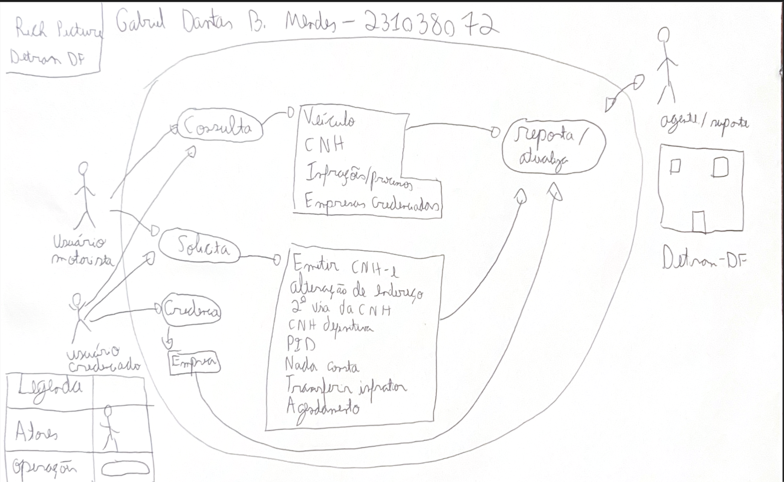

## Introdução

Artefato para monstrar o ricj picture do app que escolhemos 

## Objetivo

O objetivo desse artefato é documentar o Rcih Picture.

## Metodologia

A metodologia utilizada foi o Rich Picture

## DetranDF

O integrante responsável por avaliar o DetranDF foi o Gabriel Dantas. O Rich Picture é esse apresentado na Figura 2.

{ width=70% }

**Figura 2:** Imagem Rich Picture do app DetranDF. **Fonte:** Rich Picture  (Autoria: [Gabriel Dantas](https://github.com/gbevi)), 2025.

## Sobre a escolha do app

O aplicativo DetranDF foi escolhido a partir de uma análise comparativa entre cinco opções disponíveis. A principal motivação para a escolha foi o fato de o aplicativo apresentar diversas funcionalidades com propósitos distintos entre si, o que o tornou mais completo e interessante para fins de estudo. Entre as demais opções, uma já havia sido selecionada por outro grupo, duas apresentavam poucas funcionalidades, o que poderia comprometer a análise, e uma delas traria dificuldades para encontrar usuários reais que a utilizassem. Diante disso, o DetranDF se destacou como a alternativa mais viável e rica em possibilidades para o desenvolvimento do trabalho.

## Bibliografia

> 1. Aplicativo do DetranDF. Disponível em: Apple Store. Acesso em: 11 abr 2024.

## Histórico de versão

| Versão |    Data    |       Descrição        |                     Autor                     | Revisor |
| :----: | :--------: | :--------------------: | :-------------------------------------------: | :-----: |
|  1.0   | 10/04/2025 | Início da documentação | [Giovana Barbosa ](https://github.com/gio221) |  [João Lobo](https://github.com/joaolobo10)    |
|  1.1   | 11/04/2025 |      App sou.gov       | [Giovana Barbosa ](https://github.com/gio221) |  [João Lobo](https://github.com/joaolobo10) |
|  1.2   | 11/04/2025 |      App e-Título      | [Luiz Bessa](https://github.com/lfelipebessa) |     [Giovana Barbosa](https://github.com/gio221)     |
|  1.3   | 11/04/2025 |      App DetranDF      |  [Gabriel Dantas](https://github.com/gbevi)   |     [Giovana Barbosa](https://github.com/gio221)     |
|  1.4   | 12/04/2025 |      App BRB Mobilidade      |  [Pedro Camilo](https://github.com/PedrooCamilo)   |     [João Lobo](https://github.com/joaolobo10)     |
|  1.5   | 12/04/2025 |      App Metrô-DF      |  [João Lobo](https://github.com/joaolobo10)   |      [João Lobo](https://github.com/joaolobo10)    |
|  1.6   | 12/04/2025 |      App CNH Digital      |  [Maria Eduarda](https://github.com/maaduh)   |   [João Lobo](https://github.com/joaolobo10)       |
|  1.6   | 12/04/2025 |      Padronização das legendas      |  [João Lobo](https://github.com/joaolobo10)   |   [Giovana Barbosa](https://github.com/gio221)       |
|  1.7   | 12/04/2025 |      Arrumando o artefato priorizando o rich picture do detran df     |  [Giovana Barbosa](https://github.com/gio221)       |  