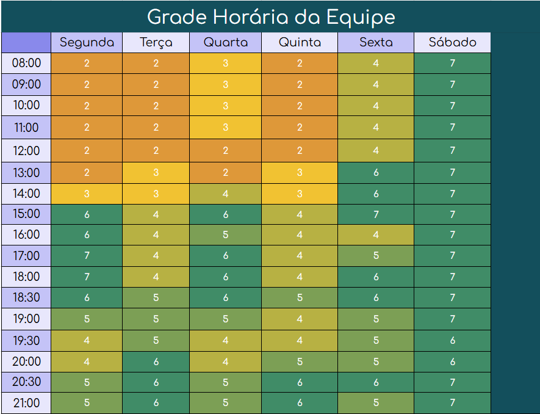

# Heatmap

## Sobre o heatmap

Um heatmap(mapa de calor) é uma representação gráfica utilizada para exibir dados de forma visual, onde diferentes cores indicam variações de intensidade, frequência ou valor. Pense nele como uma ferramenta que evidencia as áreas mais acessadas de um site, as regiões mais afetadas por uma doença ou as médias de temperatura em um país. É um recurso valioso para identificar padrões, tendências e anomalias nos dados, auxiliando na análise e na tomada de decisões.

No nosso projeto, utilizamos o mapa de calor para visualizar a disponibilidade de tempo dos integrantes da equipe, levando em consideração seus compromissos pessoais, profissionais e acadêmicos. Essa abordagem nos permite organizar os encontros de forma mais eficiente e respeitosa, evitando conflitos de agenda e sobrecarga de atividades. Com isso, promovemos a participação ativa de todos no projeto, garantindo que cada membro contribua com suas ideias e habilidades.

## Resultados

Para agilizar a identificação da disponibilidade dos membros da equipe, criamos uma planilha online compartilhada. Cada integrante indica nela os horários em que está disponível ou ocupado ao longo da semana. A partir desses dados, foi elaborado um mapa de calor que representa visualmente essas informações.

Tabela 1: Heatmap.

Fonte: [João Lobo](https://github.com/joaolobo10), 2025.

Com base nas informações da tabela acima, definimos que os encontros serão idealmente realizados às sextas-ferias às 13h. Caso seja necessário, encontros às terças-feiras também podem ser realizados, considerando a necessidade de aumentar a frequência de reuniões durante a semana. Esses horários são os mais adequados para a maioria dos integrantes do grupo, considerando suas disponibilidades e compromissos. Além disso, esses períodos nos proporcionam a oportunidade ideal para discutir assuntos relevantes ao nosso projeto.

## Referências

> 1. The complete guide to heatmaps. Disponível em: [https://contentsquare.com/guides/heatmaps/](https://contentsquare.com/guides/heatmaps/). Acesso em: 11 de abril de 2025.

## Histórico de versões

| Versão |    Data    |                                 Descrição                                  |                   Autor                    | Revisor |
| :----: | :--------: | :------------------------------------------------------------------------: | :----------------------------------------: | :-----: |
|  1.0   | 09/04/2025 |                         Criação da página Heatmap                          | [João Lobo](https://github.com/joaolobo10) |         |
|  1.1   | 11/04/2025 | Explicação sobre o heatmap, sua finalidade, resultados. Além da sua imagem | [João Lobo](https://github.com/joaolobo10) |         |
