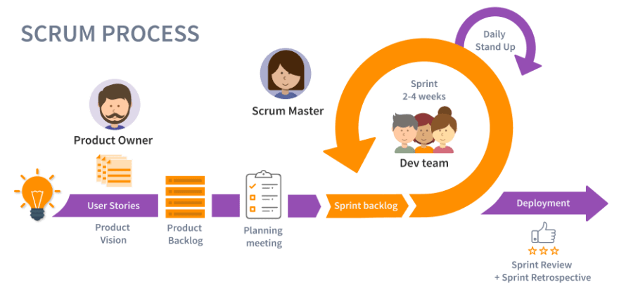

# Metodologia

## Introdução

Para aprimorar a agilidade da equipe e utilizar técnicas familiares ao grupo, optamos por adotar metodologias ágeis, especificamente o Scrum. O Scrum é uma metodologia ágil que auxilia equipes a desenvolver produtos complexos de forma adaptativa e iterativa, promovendo entregas rápidas e contínuas de incrementos funcionais.

## Fluxo do Scrum

O fluxo do Scrum é composto por eventos e artefatos que estruturam o processo de desenvolvimento. A seguir, apresentamos uma representação visual desse fluxo:



<figcaption align="center">Figura 1: Fluxo do Scrum (Fonte: <a href="https://usemobile.com.br/metodologia-scrum-desenvolvimento/" target="_blanck"> UseMobile - Metodologia Scrum para desenvolvimento de aplicativos</a>, 2020)</figcaption>

### Legenda:

- **Product Backlog**: Lista priorizada de funcionalidades, melhorias e correções necessárias para o produto.
- **Sprint Backlog**: Conjunto de itens selecionados do Product Backlog para serem desenvolvidos durante a Sprint.
- **Daily Scrum**: Reuniões diárias de curta duração para acompanhamento do progresso e identificação de impedimentos.
- **Incremento Potencialmente Entregável**: Resultado funcional e testado ao final de cada Sprint, pronto para ser entregue ao cliente.
- **Sprint**: Iteração com duração fixa (geralmente de 2 a 4 semanas) na qual um incremento do produto é desenvolvido.

## Aplicação do Scrum no Projeto

Para o desenvolvimento da documentação do aplicativo 'Detran-DF', adaptaremos o Scrum da seguinte forma:

- **Sprints Semanais**: Cada Sprint terá a duração de uma semana, iniciando com uma reunião de planejamento para definir as tarefas a serem realizadas.
- **Revisão da Sprint**: Ao final de cada Sprint, conduziremos uma reunião de revisão para demonstrar o que foi produzido e receber feedback.
- **Retrospectiva da Sprint**: Após a revisão, realizaremos uma retrospectiva para discutir o que funcionou bem, o que pode ser melhorado e como implementar essas melhorias nas próximas Sprints.

## Política de Commit

Para garantir um controle eficaz sobre as alterações nos documentos, estabelecemos a seguinte política de commits:

- **Mensagens de Commit**: As mensagens devem descrever claramente a alteração realizada e corresponder à descrição no histórico de versionamento do arquivo.
- **Alterações por Commit**: Evitar modificar mais de um arquivo de página por commit, facilitando a identificação de mudanças específicas.

Exemplo de mensagem de commit:

```git
git commit -m "Descrição clara da alteração realizada no arquivo"
```


O uso de co-autoria é permitido quando aplicável.

## Política de Revisão

Para assegurar a qualidade e precisão das informações na documentação, adotaremos a seguinte política de revisão:

- **Revisor Designado**: Após cada modificação, o autor escolherá um membro da equipe para revisar as alterações.
- **Feedback**: O revisor fornecerá feedback sobre possíveis ajustes ou melhorias necessárias.
- **Implementação das Sugestões**: O autor será responsável por implementar as sugestões aprovadas.

Esta prática será obrigatória a partir da Sprint 1, conforme acordado pela equipe.

## Inspeções

Conforme solicitado pelo professor, implementaremos um processo de inspeção para verificar a qualidade e o progresso do projeto:

- **Gravações Pré-Inspeção**: Dois dias antes da inspeção oficial, a equipe gravará uma sessão de autoavaliação do projeto, identificando pontos fortes e áreas que necessitam de melhorias.
- **Inspeção por Colegas**: Durante a inspeção oficial, outra equipe analisará nosso projeto e fornecerá feedback construtivo.
- **Acompanhamento**: As questões levantadas durante as inspeções serão registradas e abordadas nas Sprints subsequentes.

## Histórico de Versão

| Versão |    Data    |       Descrição        |                   Autor                    | Revisor |
| :----: | :--------: | :--------------------: | :----------------------------------------: | :-----: |
|  1.0   | 09/04/2025 | Criação da página de metodologia | [Luiz Bessa](https://github.com/lfelipebessa) |   [Giovana Barbosa](https://github.com/gio221)|
|  1.0   | 11/04/2025 | Correção das informações referentes à metodologia | [Luiz Bessa](https://github.com/lfelipebessa) | |

## Referências

- [Scrum.org - What is Scrum?](https://www.scrum.org/resources/what-is-scrum)
- [Atlassian - What is scrum and how to get started](https://www.atlassian.com/agile/scrum)